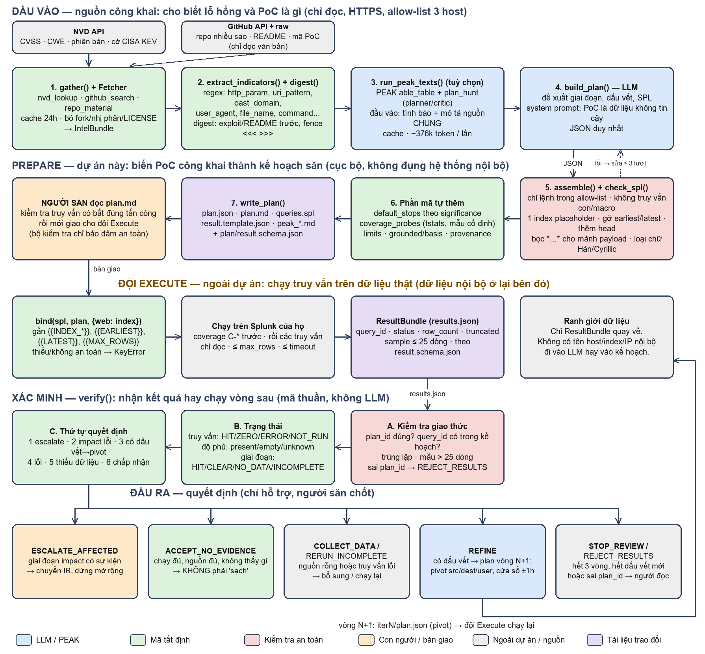

# AI Agent Hunting (v7) — PEAK Assistant + hunt tất định + khuyến nghị cho người quyết định

Công cụ hỗ trợ săn mối đe dọa theo khung PEAK. Phần **Prepare** do
[PEAK Assistant](https://github.com/Cisco-Talos/PEAK-Assistant) (Cisco Talos) đảm nhiệm, phần **Execute**
chạy các predicate literal trên telemetry, phần **Act** đưa ra *khuyến nghị có xếp hạng* để người săn
mối đe dọa quyết định. Hệ thống không tự hành động.

```text
PoC (JSON) ──► PEAK Assistant: ABLE table + hunt plan (planner/critic)      [LLM, tham khảo]
          ──► Execute: predicate field/op/value trên CDB (SQLite)           [tất định, không LLM]
          ──► Judge + Advisor (LLM) + luật tất định                          [tham khảo]
          ──► recommendation.md / .json  → NGƯỜI QUYẾT ĐỊNH
```

Bất biến: LLM không tạo hay sửa bằng chứng; bản ghi chỉ đến từ adapter. Kết quả rỗng khi nguồn telemetry
không có dữ liệu được báo là `COLLECT_DATA_THEN_RERUN`, không phải "sạch".

## Hướng mới: Prepare-only từ PoC công khai

Dự án chỉ làm đúng chữ **P** (Prepare) của khung PEAK. Đầu vào là PoC công khai (CVE, repo GitHub nhiều sao). Đầu ra là
**kế hoạch săn**: giả sử PoC này được dùng để tấn công, các giai đoạn tấn công, dấu vết mỗi giai đoạn, truy vấn SPL chỉ đọc, giới hạn
và điểm dừng. Đội Execute chạy kế hoạch trên dữ liệu của họ; sau đó `verify` quyết định chấp nhận kết quả hay sinh vòng pivot tiếp theo.
Không đụng hệ thống nội bộ, không chạy PoC.



### Vai trò từng phần

| Phần (hàm chính) | Vai trò | Dùng LLM? |
|---|---|---|
| **Nguồn công khai** (NVD, GitHub) | Cho biết lỗ hổng là gì (CVSS, phiên bản, có bị khai thác ngoài thực tế không) và PoC làm gì. Chỉ đọc văn bản, qua 3 host cố định. | Không |
| **1. `gather()` + `Fetcher`** | Thu thập tình báo, có cache; chọn repo theo số sao, bỏ fork, file nhị phân và file nhiễu. | Không |
| **2. `extract_indicators()` + `digest()`** | Trích tất định các dấu vết (tham số HTTP, chuỗi payload, tên miền out-of-band, tên file...) và gói văn bản cho LLM. Danh sách này dùng để đối chiếu, nhằm không để LLM bịa. | Không |
| **3. `run_peak_texts()`** (tuỳ chọn) | PEAK Assistant viết bảng ABLE và kế hoạch săn làm ngữ cảnh. Chỉ thấy văn bản công khai và mô tả nguồn dữ liệu chung. Tốn nhiều token. | Có |
| **4. `build_plan()`** | LLM đề xuất giai đoạn tấn công, dấu vết và truy vấn SPL. PoC được coi là dữ liệu không tin cậy, không phải chỉ dẫn. | Có |
| **5. `assemble()` + `check_spl()`** | Chốt chặn an toàn: chỉ cho truy vấn chỉ đọc trong danh sách lệnh cho phép, tự gắn cửa sổ thời gian và trần dòng; truy vấn process trên endpoint buộc phải lọc theo tiến trình cha (không thì `whoami` của quản trị viên cũng khớp); chữ lẫn ngôn ngữ khác bị yêu cầu viết lại; truy vấn sai bị gửi lại để sửa (tối đa 3 lượt), vẫn sai thì loại. | Không |
| **6. Phần mã tự thêm** | Điểm dừng theo mức ý nghĩa của giai đoạn, truy vấn kiểm tra độ phủ nguồn, giới hạn, nhãn xuất xứ. LLM không quyết định các thứ này. | Không |
| **7. `write_plan()`** | Ghi `plan.json`, `plan.md`, `queries.spl`, `result.template.json` và schema, tức là các tài liệu bàn giao. | Không |
| **Người săn đọc `plan.md`** | Kiểm tra truy vấn có bắt đúng tấn công không trước khi giao. Bộ kiểm tra chỉ bảo đảm an toàn và hình thức, không bảo đảm đúng nội dung. | |
| **Đội Execute** (ngoài dự án) | `bind()` ánh xạ placeholder sang index thật, chạy truy vấn trên Splunk của họ rồi trả `ResultBundle`. Dữ liệu nội bộ ở lại bên họ. | |
| **`verify()`** | Kiểm tra giao thức, tính trạng thái từng truy vấn, độ phủ và từng giai đoạn, rồi chọn quyết định theo thứ tự ưu tiên. | Không |
| **Quyết định** | `ESCALATE_AFFECTED` (chuyển IR), `ACCEPT_NO_EVIDENCE` (không phải "sạch"), `COLLECT_DATA`/`RERUN_INCOMPLETE`, `REFINE` (vòng pivot N+1, cửa sổ ±1 giờ), `STOP_REVIEW`/`REJECT_RESULTS`. Chỉ hỗ trợ; người săn chốt. | |

Vòng lặp dừng khi chuyển IR, chấp nhận, hết 3 vòng, hoặc không còn giá trị mới để pivot.

### Lệnh

```bash
python main.py plan --cve CVE-2021-44228 --min-stars 500      # cần LLM trong .env; --no-peak để bỏ PEAK (nhanh, ít token)
python main.py verify --plan artifacts/plans/CVE-2021-44228/iter1/plan.json --results results.json
python main.py schema --out schemas/                           # JSON Schema của HuntPlan và ResultBundle
```

Chi tiết, hợp đồng dữ liệu, mô hình an toàn và giới hạn: [`docs/PREPARE-WORKFLOW.md`](docs/PREPARE-WORKFLOW.md). Pipeline
Prepare→Execute→Act bên dưới vẫn còn, dùng làm bộ thử cục bộ trên dữ liệu BOTS v1 công khai.

## Cài đặt (Python ≥ 3.12)

```bash
python -m venv .venv
.venv\Scripts\activate          # Windows;  source .venv/bin/activate trên Linux/macOS
pip install -e ".[dev]"          # lõi tất định, KHÔNG cần LLM
pip install -e ".[peak]"         # tuỳ chọn: PEAK Assistant (pin theo commit) cho pha Prepare
cp .env.example .env             # tuỳ chọn: điền LLM_ENDPOINT, LLM_API_KEY, LLM_MODEL (endpoint tương thích OpenAI)
```

LLM là tuỳ chọn: chưa cài extra `peak` hoặc chưa điền `.env` thì hệ thống tự chạy phần tất định và đưa khuyến nghị
theo luật (in một dòng `[i]`). `--model NAME` ghi đè `LLM_MODEL` (ví dụ mô hình `:free` của OpenRouter).

Luận văn/đồ án đầy đủ (lý thuyết, thiết kế, hướng dẫn thực hành, thực nghiệm, phụ lục): `docs/thesis/`
(`LUAN-VAN-AI-AGENT-HUNTING.docx` / `.pdf`; dựng lại bằng `python docs/thesis/build_thesis.py`).

## Chạy

```bash
# Tất cả PoC trong pocs/ (PEAK Assistant + LLM; mỗi PoC ~4-8 phút vì planner/critic lặp)
python main.py --poc-dir pocs --db data/botsv1_eval.sqlite

# Một PoC, cửa sổ tự chọn
python main.py --poc pocs/poc-joomla-rce.json --window 2016-08-10T21:36:00Z/2016-08-10T22:00:00Z

# Chỉ phần tất định (không PEAK, không LLM)
python main.py --poc-dir pocs --offline

# Dữ liệu nhạy cảm + LLM từ xa: che host/user/IP trong mọi thứ gửi cho judge/advisor
python main.py --poc-dir pocs --redact
```

Vận hành LLM (đều tuỳ chọn):

| Cờ / biến | Tác dụng |
|---|---|
| `--judge-votes N` (mặc định 3) | judge gọi N lần, lấy đa số; độ tin cậy = thấp nhất trong nhóm đa số; không đa số thì không có judgment |
| `--redact` | che host/user/IP (và mọi IPv4) trước khi gửi, khôi phục trong báo cáo; xem giới hạn ở `src/hunting/redact.py` |
| `--token-budget N` | tối đa N token mỗi PoC (mọi agent kể cả trong PEAK); chạm trần thì các lời gọi sau bị từ chối, không retry |
| `--cache-dir DIR` / `--no-cache` / `--refresh-prepare` | cache kết quả PEAK Prepare theo (PoC, mô tả dữ liệu, model, phiên bản PEAK): chạy lại cùng PoC là tức thì và cho đúng cùng ABLE/kế hoạch |
| `LLM_MODEL_FALLBACKS`, `LLM_TEMPERATURE`, `LLM_MIN_INTERVAL` | model dự phòng, temperature cho judge/advisor (mặc định 0), giãn cách giữa các lời gọi |

Báo cáo ghi model thực sự trả lời (khác `auto`), token của mọi agent (kể cả PEAK), số lần chuyển model dự phòng và trạng thái cache.

Kết quả nằm ở `artifacts/runs/<thời gian>/`: `summary.md`, và mỗi PoC có `recommendation.md`,
`recommendation.json`, `peak_able.md`, `peak_hunt_plan.md`, ledger, bản nháp SPL (`act/`).
Mẫu kết quả đã kiểm chứng: [`results/`](results/).

## Kiểm thử

```bash
python -m pytest tests -q
ruff check .
```

## Cấu trúc

| Đường dẫn | Vai trò |
|---|---|
| `src/hunting/llm.py` | `.env` → cấu hình `model_config.json` của PEAK; caller đồng bộ dùng chung client PEAK |
| `src/hunting/prepare.py` | cầu nối PEAK: `able_table`, `plan_hunt` (tuỳ chọn `researcher`); có fallback offline |
| `src/hunting/poc/` | mô hình PoC, loader JSON, agent thực thi, judge |
| `src/hunting/adapters/` | adapter CDB (SQLite); `source_presence`, `describe_data`. Adapter Splunk live chỉ còn trong lịch sử git (commit `4dace56`) |
| `src/hunting/recommend.py` | luật khuyến nghị + advisor |
| `src/hunting/pipeline.py`, `cli.py`, `report.py` | điều phối, CLI, báo cáo |
| `pocs/` | PoC mẫu (BOTS v1) |
| `docs/ARCHITECTURE.md`, `docs/BAO-CAO-PEAK-ASSISTANT.md` | kiến trúc, luật khuyến nghị, giới hạn; báo cáo thay đổi và kết quả |
| `src/hunting/intel/`, `src/hunting/plan/`, `plan_cli.py` | hướng Prepare-only: tình báo công khai → `HuntPlan` → `verify` (xem mục đầu và `docs/PREPARE-WORKFLOW.md`) |
| (lịch sử git) | engine v6 (ClaimGraph) và tài liệu cũ nằm trong lịch sử git: `git checkout v6-engine-final` (commit `9d49fe1`, có trong lịch sử nhánh `huy`) |
