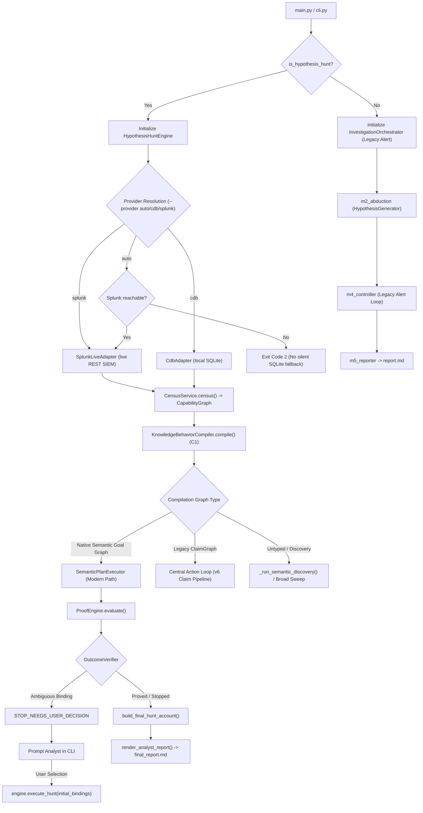

# Actual Call Graph & Execution Branch Analysis

## 1. Entry Points

The AI Agent Hunting platform contains four primary execution entry points:

1. **`main.py`**
   - Direct CLI wrapper invoking `hunting.cli.main()`.
   - Entry point for all console/terminal commands.

2. **`src/hunting/cli.py` (`main()`, `run_cli()`)**
   - Parses arguments and determines whether to trigger:
     - **Hypothesis Threat Hunting Mode** (`is_hypothesis_hunt = True` when `--cve`, `--ttp`, `--ioc`, `--threat-actor`, `--campaign`, `--query`, `--hypothesis`, or `--hypothesis-file` is passed).
     - **Legacy Alert Investigation Mode** (`is_hypothesis_hunt = False`, fallback when `--alert`, `--host`, etc., are provided without hypothesis context).
     - **Forensic Subcommands** (`show-observation`, `replay-query`, `--list-indexes`).

3. **`src/hunting/engine.py` (`HypothesisHuntEngine.execute_hunt()`)**
   - The central engine for hypothesis-driven threat hunting.
   - Orchestrates capability census, semantic goal compilation, capability selection/routing, and execution.

4. **`src/hunting/orchestrator.py` (`InvestigationOrchestrator.investigate()`)**
   - The legacy orchestrator for alert triage and abduction.
   - Strictly alert-driven; disconnected from the modern `SemanticGoalGraph` pipeline.

---

## 2. High-Level Branching Architecture

---

## 3. Detailed Call Traces by Execution Path

### Path 1: Modern Semantic Graph Execution (Active Target Flow)
1. **Invocation**:
   - `cli.py` invokes `HypothesisHuntEngine.execute_hunt(req, adapter, time_window, step_callback, analyst_confirm_callback)`.
2. **Setup**:
   - `ObservationLedger` and `StepTrace` initialized.
   - `CensusService.census(configured_adapters)` probes available indexes/tables and creates `CapabilityGraph`.
3. **Semantic Compilation (Phase C1)**:
   - `KnowledgeBehaviorCompiler.compile(request)` parses `HuntRequest`.
   - If CVE/TTP: deterministic offline KB lookup in `knowledge_base.py`.
   - If natural language: calls `ApiLLMProvider` (via `compiler_caller`) with `PROMPT_SEMANTIC_COMPILATION`.
   - Output: `SemanticGoalGraph` attached to `objective.semantic_goal_graph`.
   - Request literals grounded in variables via `_mark_request_grounded_values`.
4. **Capability Selection & Routing (Phase C2)**:
   - `CapabilityRetriever` matches goal graph relations to available provider operations.
   - `SourceProfiler` probes unprofiled sourcetypes/tables and derives `ConstraintMapping`s and `RuntimeCapability`s.
   - Produces `LogicalPlan` (`SemanticLogicalPlan`) with ordered `PlanStep`s.
5. **Plan Execution**:
   - Line 2168 of `engine.py`: calls `self.execute_semantic_plan(state, active_adapter, scope, ledger, initial_bindings)`.
   - Passes plan to `SemanticPlanExecutor.execute(...)`.
   - For each step:
     - Checks gate conditions (`GateEvaluator`).
     - Verifies upstream input binding provenance (`VERIFIED` vs `CANDIDATE`).
     - Translates step constraints to native query predicates (`CDBAdapter` or `SplunkLiveAdapter`).
     - Ingests returned rows as `Observation`s.
     - Calls `ProofEngine.evaluate(goal, operation, result, observations, bindings, goal_graph)`.
6. **Proof & Verdict Adjudication**:
   - `ProofEngine` validates contract conformance, role mappings, and row-level semantic transforms (`PowerShellInterpreterTransform`, etc.).
   - Goal verdicts recorded with statuses: `SUPPORTED`, `INCONCLUSIVE_RESTRICTIONS_UNVERIFIED`, `PARTIAL`, or `INCONCLUSIVE`.
   - `OutcomeVerifier` verifies whether answer variable bindings are backed by proved relations.
7. **Reporting & Artifacts**:
   - `build_final_hunt_account(state, ledger)` consolidates execution traces, evidence cards, citations, and cost accounting.
   - `render_analyst_report(account)` emits 6-section analyst report.
   - `persist_hunt_artifacts()` persists raw artifacts into `artifacts/<hunt_id>/`.

---

### Path 2: Legacy ClaimGraph & Central Action Loop (Active Legacy)
1. **Trigger Condition**:
   - `claim_graph` is attached to `objective` (older v6 requests).
2. **Execution**:
   - `goal_graph_from_claim_graph` converts claims to `SemanticGoalGraph`.
   - Line 2529 of `engine.py`: enters `claim_graph_active` loop.
   - Drives execution via `CanonicalActionController.plan_action` over `Cell`s and `Expectation`s.
   - Dispatches broad sweeps and pivots (up to `MAX_PIVOTS_PER_HUNT = 3`).
   - Group builder clusters delta observations into `EvidenceCard`s.
3. **Termination**:
   - Evaluates hypothesis status via `EvidenceEvaluator.evaluate_evidence_advisory`.
   - Stops when claims are satisfied or budget exhausted.

---

### Path 3: Legacy Alert Investigation (Active Legacy)
1. **Trigger Condition**:
   - CLI called without hypothesis flags: `python main.py --alert <path>` or `python main.py -i`.
2. **Execution**:
   - `cli.py` creates `InvestigationOrchestrator(registry, adapters, llm_provider)`.
   - `orchestrator.investigate(alert)`:
     - Generates explanations via `m2_abduction.HypothesisGenerator`.
     - Plans queries via `m4_controller.ActionPlanner`.
     - Queries local CDB database.
     - Updates beliefs and builds `InvestigationResult`.
   - Formats Markdown via `m5_reporter.render_report()`.

---

## 4. Adapter Selection, Fallback, & Stopping Logic

### Adapter Selection Flow
- `cli.py` evaluates `--provider`:
  - `splunk`: Uses `SplunkLiveAdapter`. Auto-discovers index if not specified. Validates index reachability.
  - `cdb`: Uses `CdbAdapter`. Connects to SQLite database (`data/cdb_sample.sqlite` or `:memory:`).
  - `auto`:
    - In hypothesis hunt mode: Calls `SplunkLiveAdapter.is_available()`. If reachable $\rightarrow$ `splunk`. If unreachable $\rightarrow$ **Exits with code 2** (Strict rule: No silent fallback to SQLite).
    - In legacy alert mode: Defaults to `cdb`.

### Stopping Decisions
The system records explicit stopping taxonomy states:
- `STOP_ANSWERED`: All required goals `SUPPORTED`, target variable binding verified by proof.
- `STOP_REFUTED`: Negative evidence contract proved absence of required artifacts.
- `STOP_NEEDS_USER_DECISION`: Candidate binding ambiguity (e.g. multiple candidate hosts detected).
- `STOP_NEEDS_CLARIFICATION`: Request statement underspecified or lacking essential entity anchors.
- `STOP_UNSUPPORTED`: Goal relations cannot be routed to any available provider operation.
- `STOP_BUDGET_EXHAUSTED`: Query or turn budget exhausted without conclusive proof.
- `STOP_UNREACHABLE` / `BACKEND_DEGRADED`: Telemetry provider timed out or query failed.

### Budget & LLM Tracking
- `LLMUsageTracker` tracks prompt tokens, completion tokens, call counts, and dollar costs per phase (`compiler`, `source_profiler`, `planner`, `adaptive_planner`, `evaluator`).
- `LLMBudgetPolicy` enforces phase-specific input token limits and global call caps.
- `--unbounded-llm` flag creates an unbounded policy for diagnostic E2E testing.
