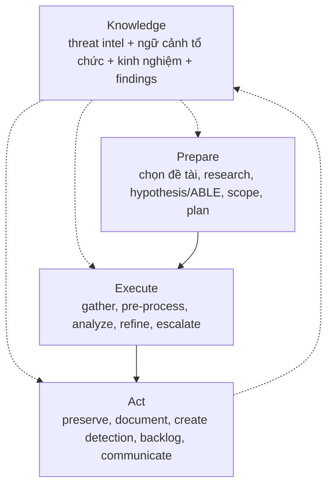
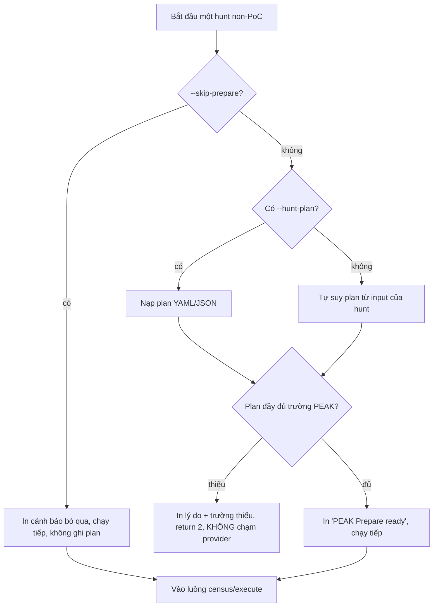
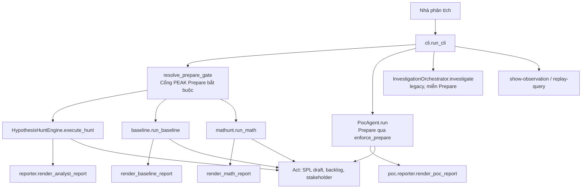
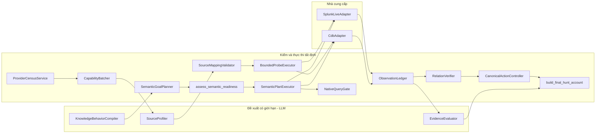
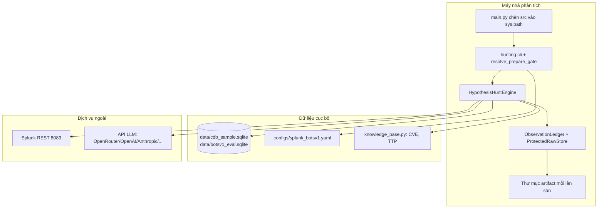
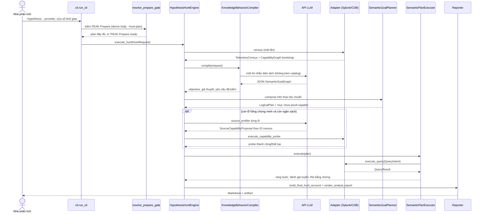
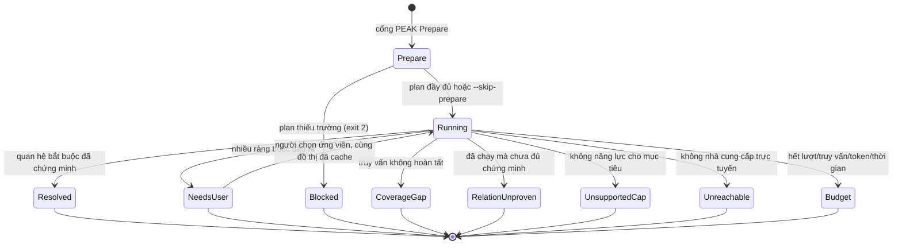
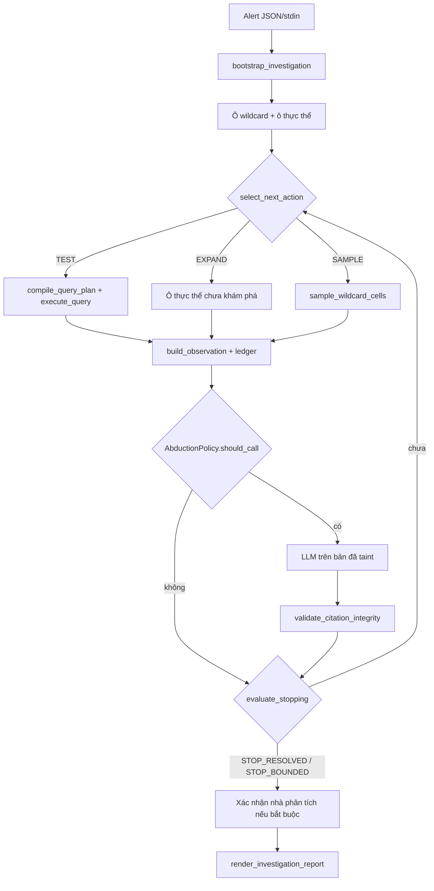

# AI Agent Hunting: Tác tử điều tra mối đe dọa bị ràng buộc bởi bằng chứng, vận hành theo khung PEAK của Splunk

**Báo cáo kỹ thuật dạng bài báo**

| Mục | Giá trị |
|---|---|
| Hệ thống | AI Agent Hunting, gói Python `hunting` phiên bản `0.1.0` |
| Hợp đồng kiến trúc đang có hiệu lực | v7, văn bản chuẩn `01_FINAL-ARCHITECTURE.md` |
| Khung quy trình | PEAK (Prepare, Execute, Act + Knowledge) của Splunk SURGe |
| Phạm vi mã kiểm kê | `src/hunting`: 260 lớp, 658 hàm và phương thức |
| Bộ kiểm thử | 74 tệp unit, 1 tệp integration, 2 tệp eval |
| Kết quả kiểm thử đo trong phiên báo cáo | 514 passed, 13 skipped, 0 failed |
| Dữ liệu đánh giá | BOTS v1: eval DB 4.42M dòng (`data/botsv1_eval.sqlite`) + sample 16 sự kiện (`data/cdb_sample.sqlite`) |
| Ngày lập báo cáo | 2026-09-22 |
| Đối tượng đọc | người triển khai, người phản biện kiến trúc, nhà phân tích SOC, hội đồng đánh giá |

Tài liệu này mô tả hệ thống như nó đang tồn tại trong kho mã: cơ sở lý thuyết mà hệ thống vay mượn, khung PEAK của Splunk mà hệ thống bám theo, lý thuyết săn mối đe dọa (threat hunting) làm nền, kiến trúc và luồng hoạt động, môi trường và dữ liệu kiểm thử, cách chạy từng loại test, kết quả và tỉ lệ đo được, các hạn chế, và cuối cùng là chương tài liệu tham khảo. Mọi con số trong báo cáo đều truy được về một tệp nguồn trong kho hoặc một lần chạy đã ghi lại; phần chưa đo được nói rõ là chưa đo.

---

## Mục lục

1. Tóm tắt
2. Bài toán
3. Cơ sở lý thuyết: săn mối đe dọa và điều tra dựa trên bằng chứng
4. Khung PEAK của Splunk và cách hệ thống hiện thực hóa
5. Cổng PEAK Prepare bắt buộc (thay đổi mới nhất)
6. Mô hình nhận thức: năm tầng sự thật
7. Kiến trúc hệ thống (kèm sơ đồ)
8. Luồng hoạt động chính (kèm sơ đồ trình tự và trạng thái)
9. Vai trò của mô hình ngôn ngữ và cơ chế M-ATH
10. Môi trường và dữ liệu kiểm thử (BOTS v1)
11. Cách kiểm thử: các lớp test và lệnh chạy
12. Kết quả và tỉ lệ từng lớp test
13. Hạn chế trung thực
14. Kết luận
15. Tài liệu tham khảo

---

## 1. Tóm tắt

AI Agent Hunting là một tác tử điều tra an ninh bám theo khung **PEAK** (Prepare, Execute, Act + Knowledge) của Splunk SURGe. Hệ thống nhận một câu hỏi, một giả thuyết, một CVE, một kỹ thuật MITRE ATT&CK, một chỉ báo xâm phạm (IOC), một cảnh báo, hoặc một bằng chứng khái niệm (PoC) đã cấu trúc. Nó trả về một câu trả lời có trích dẫn, hoặc một kết quả không kết luận kèm lý do dừng minh bạch.

Nguyên tắc trung tâm: **quyết định thuộc về logic tất định, không thuộc về mô hình ngôn ngữ.** Hệ thống giữ ba đồ thị tách biệt — `SemanticGoalGraph` (điều cần chứng minh), `CapabilityGraph` (nguồn nào quan sát được điều đó), `EvidenceGraph` (điều gì đã được quan sát và kiểm chứng). Mô hình ngôn ngữ chỉ *đề xuất* đồ thị mục tiêu và ánh xạ nguồn–trường. Bộ biên dịch tất định, bộ kiểm hợp đồng, bộ thực thi truy vấn, sổ cái quan sát và bộ kiểm chứng quan hệ mới được tạo ra sự thật.

Ba kết quả đo được, tất cả trên dữ liệu BOTS v1 thật:

- **Bộ kiểm thử phần mềm:** 514 test đạt, 13 bỏ qua (do cần Splunk sống hoặc mạng), 0 thất bại.
- **Độ đặc hiệu (specificity):** 4 PoC dựng sẵn chạy trên 4.38 triệu dòng telemetry lành tính → **0 dương tính giả** (trước khi sửa 2 lỗi là 0.000023, tức 100 dòng sai).
- **Độ nhạy (recall) trên tấn công thật:** PoC Joomla RCE trên ~19.7k dòng web thật → **MATCHED, 199 quan sát, 2/2 bước**; LLM judge chấm TRUE_POSITIVE với độ tự tin 0.85–0.87.

Thay đổi mới nhất được ghi trong báo cáo này: **cổng PEAK Prepare đã trở thành bắt buộc trên mọi đường săn** (giả thuyết, baseline, M-ATH), không chỉ đường PoC. Chi tiết ở Chương 5.

---

## 2. Bài toán

Một nhà phân tích săn mối đe dọa thường bắt đầu từ một câu tiếng người: "Amber Turing đã vào một trang đối thủ. Tên miền đó là gì?", "máy này có bị khai thác CVE-2024-21887 không?", hoặc một cảnh báo EDR chỉ có tên máy chủ và thời điểm. Câu trả lời đúng phụ thuộc vào telemetry thật: Splunk, một cơ sở SQLite kiểm thử (gọi là CDB), và về sau có thể là EDR hoặc thư. Schema của các nguồn đó không thống nhất, và **tên nguồn không phải nghĩa của dữ liệu**: một nguồn tên SMTP mà thiếu trường người gửi và người nhận thì không phải thư.

Ba lỗi lặp lại trong các tác tử điều tra kiểu tự do, mà hệ thống này được xây để chặn bằng hợp đồng chứ không bằng lời nhắc:

1. Mô hình ngôn ngữ viết thẳng SPL và tự tuyên bố kết quả.
2. Một từ khóa trong câu hỏi (`email`, `Tor`, `CVE`, `web`) chọn sẵn một kịch bản điều tra.
3. Truy vấn trả về rỗng bị đọc thành "không có tấn công".

Đối tượng người dùng là nhà phân tích và người xây hệ thống săn mối đe dọa trên telemetry doanh nghiệp, trước mắt là Splunk và backend SQLite CDB. Kho không phải sản phẩm SOC đóng gói; nó là một hiện thực nghiên cứu của khung PEAK với ràng buộc bằng chứng chặt.

---

## 3. Cơ sở lý thuyết: săn mối đe dọa và điều tra dựa trên bằng chứng

### 3.1. Định nghĩa săn mối đe dọa

Săn mối đe dọa (threat hunting) là quy trình thủ công hoặc có máy hỗ trợ nhằm tìm những sự cố mà hệ thống phát hiện tự động (rule, signature, alert) đã bỏ sót. Đặc trưng của nó là **giả định có kẻ địch trong mạng** rồi đi tìm bằng chứng, thay vì chờ cảnh báo. Điểm mấu chốt về mặt phương pháp: một cuộc săn không tìm thấy gì vẫn có giá trị nếu nó ghi lại rõ đã tìm ở đâu và chưa tìm ở đâu — tức là phân biệt "không có bằng chứng" với "có bằng chứng về sự vắng mặt".

### 3.2. Điều tra đa chặng và đồ thị nguồn gốc

Các công trình nền tảng nâng đỡ quyết định giữ một đồ thị bằng chứng có trích dẫn thay vì một đoạn văn của mô hình:

- **SLEUTH** (Hossain và cộng sự, USENIX Security 2017) dựng lại đồ thị phụ thuộc từ nhật ký audit để truy vết một xâm nhập qua tiến trình, tệp và mạng.
- **HOLMES** (Milajerdi và cộng sự, IEEE S&P 2019) tương quan các luồng thông tin đáng ngờ của một chiến dịch nhiều giai đoạn và gắn chúng với các bước ATT&CK.
- **OmegaLog** (Hassan và cộng sự, NDSS 2020) hòa giải ngữ cảnh ứng dụng, hệ thống và mạng để giữ độ trung thực của một sự kiện khi nó đi qua nhiều tầng log.

Ba công trình này nâng đỡ nguyên tắc "bằng chứng có nguồn gốc", nhưng **không** bắt mọi câu hỏi phải đi qua một đồ thị tấn công cố định. Một câu hỏi tra cứu tên miền có thể dừng ở một quan hệ đã chứng minh; một câu hỏi về chuyển trạng thái tệp mới cần hợp đồng vai trò thời gian, hành động, trạng thái và định danh hiện vật.

### 3.3. Truy vấn logic có kiểu đứng trước cú pháp gốc

**AIQL** (Gao và cộng sự, USENIX ATC 2018) đưa một ngôn ngữ truy vấn hành vi có kiểu lên trên dữ liệu audit rồi lập kế hoạch thực thi. **ThreatRaptor** (Gao và cộng sự, ICDE 2021) tách bước rút hành vi có cấu trúc khỏi bước tổng hợp truy vấn. Hệ thống này vay cấu trúc đó: `SemanticGoalGraph` và `QueryIntent` là lớp trung gian có kiểu; SPL và SQL là sản phẩm mà adapter biên dịch ra sau cùng.

### 3.4. Vòng giả thuyết – bằng chứng – hành động và sự không chắc chắn tường minh

- **Evidential Cyber Threat Hunting** (arXiv:2104.10319) mô hình hóa tri thức, giả thuyết và hành động cùng độ không chắc chắn tường minh.
- **ATHAFI** (arXiv:2003.03663) thu thập telemetry thích nghi để kiểm giả thuyết.
- **TaHiTI** (FI-ISAC) là vòng đời săn theo giả thuyết mà giới thực hành ngân hàng dùng.
- **Maxam và cộng sự** (USENIX Security 2024) đo thực địa và cho thấy quy trình săn rất đa dạng — một workflow duy nhất áp cho mọi câu hỏi là một giả định yếu.

Từ đó hệ thống giữ các quyết định dừng tách nhau: đã giải, bị bác, không kết luận, thiếu phủ, thiếu năng lực, không tới được nguồn, hết ngân sách. Các bài báo chỉ nâng đỡ việc **gọi tên** sự không chắc chắn thay vì ép một nhãn âm tính.

### 3.5. Schema, năng lực, và khớp schema bằng mô hình có kiểm sau

OCSF (lược đồ sự kiện trung lập nhà cung cấp), MITRE ATT&CK Data Components (tính chất quan sát được của từng kỹ thuật), và OpenTelemetry nâng đỡ ý tưởng `CapabilityGraph`: một thao tác nhà cung cấp khai báo kiểu đầu vào, kiểu sự thật đầu ra, phân vùng, quyền, phân trang và độ hoàn tất. Các công trình khớp schema bằng mô hình ngôn ngữ (Schema Matching with LLMs arXiv:2407.11852, ReMatch, CHESS, RAT-SQL) và truy hồi công cụ theo cân bằng độ phủ–ngữ cảnh (ToolShed, MDB-Link) nâng đỡ thiết kế `CapabilityBatcher` và `SourceProfiler`: điểm số chỉ sắp thứ tự xử lý, không loại nguồn; ứng viên của mô hình chỉ thành năng lực thật sau khi validator đối chiếu census và adapter chạy probe.

### 3.6. Dùng công cụ an toàn và đánh giá tác tử

Verifiably Safe Tool Use tách ý định khỏi thực thi công cụ đã kiểm; Retrieve-Plan-Generation (EMNLP 2024) lập kế hoạch lặp theo bằng chứng đã lấy; ExCyTIn-Bench của Microsoft Research là băng thử tác tử điều tra đa bước trên đồ thị bằng chứng; DARPA Transparent Computing cung cấp dữ liệu nguồn gốc. Các nguồn này nâng đỡ ranh giới: mô hình không gọi nhà cung cấp trực tiếp; ngân sách cuộc gọi/token/truy vấn/thời gian được ghi; độ chính xác ánh xạ nguồn, cạnh bằng chứng và câu trả lời phải đo riêng.

> Ghi chú trung thực: "nâng đỡ" không có nghĩa "chứng minh đúng sơ đồ lớp cụ thể của kho này". Tên lớp, lời nhắc, ngưỡng ngân sách, enum dừng và mọi số F1 chưa có nhãn vẫn là lựa chọn kỹ thuật cục bộ. Bảng truy vết đầy đủ nằm ở Chương 15 và tệp `03_LITERATURE-AND-TRACEABILITY.md`.

---

## 4. Khung PEAK của Splunk và cách hệ thống hiện thực hóa

### 4.1. PEAK là gì

PEAK (**P**repare, **E**xecute, **A**ct — với **K**nowledge thấm vào mọi phase) là khung săn mối đe dọa hiện đại của Splunk SURGe (David Bianco, Ryan Fetterman, 2023), thay cho các khung cũ Sqrrl và TaHiTI. Bản chất PEAK là **quy trình cho nhà phân tích con người**, không phải một đặc tả phần mềm. PEAK định nghĩa ba loại hunt, cùng chạy qua ba phase Prepare → Execute → Act:

1. **Hypothesis-Driven** — đặt giả thuyết về hoạt động kẻ địch rồi dùng dữ liệu xác nhận/bác bỏ.
2. **Baseline / EDA** — vẽ chân dung "bình thường" để soi lệch.
3. **M-ATH (Model-Assisted Threat Hunting)** — dùng mô hình/thuật toán để tìm lead khi phương pháp đơn giản không đủ.



**Mô hình ABLE** biến một giả thuyết thành kế hoạch hành động: **A**ctor (ai đánh, được phép trống), **B**ehavior (TTP cụ thể), **L**ocation (đánh ở đâu trong mạng), **E**vidence (cần nguồn nào, trúng thì trông thế nào).

### 4.2. Lập trường của kho về PEAK

Kho này **không nhận chứng nhận PEAK** của Splunk. Nó hiện thực hóa bốn cửa của quy trình PEAK và giữ nguyên những thứ PEAK không quy định (hợp đồng bằng chứng, kiểm chứng, trần chi phí). Bảng dưới đối chiếu "ngôn ngữ PEAK" với "bản chất kỹ thuật" trong kho:

| Ngôn ngữ PEAK | Bản chất trong hệ thống | Vị trí trong mã |
|---|---|---|
| Prepare: hypothesis + ABLE + scope + plan | Cổng bắt buộc: từ chối chạy nếu thiếu topic, behavior, location, evidence, scope, max_duration, plan, research_refs. Actor được để trống. Token cụ thể trong ABLE (file, flag, IP, chuỗi trích dẫn, host có chữ số, `DOMAIN\user`) thành predicate | `hunting/peak.py`, `hunting/cli.py`, `poc/compiler.py` |
| Execute: gather → analyze → refine → escalate | `PocAgent` chạy pass 1, ghi analyze, tối đa một pass refine, rồi ghi gói IR khi có finding. Engine ghi cùng quyết định vào `peak_execute_log` mà không mở query không trần | `poc/agent.py`, `engine.py`, `peak.py` |
| Baseline / EDA | `--baseline` giữ EDA tất định (data dictionary, distribution, outlier, gap), rồi Act qua `commit_act` | `baseline/baseline.py`, `act/act.py` |
| M-ATH | `--math` gửi mẫu hàng tới API LLM trong `.env` (model pretrained, không train cục bộ); lead chỉ sống nếu giá trị nằm trong hàng đã kéo | `mathunt/mathunt.py` |
| Act: detection + backlog + communicate | `validate_spl` kiểm SPL đọc-only; backlog append `backlog.jsonl`; stakeholder ghi Markdown | `act/act.py` |
| Knowledge | MITRE refs + research_refs + PoC library + ledger các lần chạy | `compiler/knowledge_base.py`, `artifacts/` |

**Điểm cần nói đúng khi báo cáo:** `VALIDATED` chỉ nghĩa là parser Splunk chấp nhận cú pháp SPL, không phải một detection đã được chứng minh ít dương tính giả; ABLE chỉ lái query bằng token cụ thể, một câu behavior thuần văn xuôi không thêm predicate.

---

## 5. Cổng PEAK Prepare bắt buộc (thay đổi mới nhất)

### 5.1. Bối cảnh và động cơ

Trước thay đổi này, cổng PEAK Prepare chỉ bắt buộc trên **đường PoC** (qua `missing_prepare_fields()` và ngoại lệ `PrepareError`). Ba đường săn còn lại — hypothesis engine (`--hypothesis/--cve/--ttp/--ioc/--query`), baseline (`--baseline`), và M-ATH (`--math`) — chạy thẳng, không qua Prepare. Điều này mâu thuẫn với nguyên tắc PEAK "không có hunt nào không có Prepare".

### 5.2. Thay đổi đã thực hiện

Cổng Prepare nay bắt buộc trên **mọi đường săn** (trừ đường cảnh báo legacy — vốn là triage alert, không có giả thuyết để chuẩn bị). Ba thành phần mới:

1. **`peak.py`** thêm hai hàm:
   - `derive_prepare_plan(...)`: tự suy một Prepare plan tối thiểu-nhưng-đầy-đủ (topic, ABLE, scope, max_duration, plan, research_refs) từ chính input của hunt. `max_duration` suy từ span của cửa sổ thời gian.
   - `missing_prepare_fields_from_plan(plan)`: kiểm checklist PEAK trên dict plan (đường non-PoC không có object PoC), dùng chung danh sách trường bắt buộc `_REQUIRED`.
   - `load_hunt_plan` được sửa đọc `utf-8-sig` để chịu được BOM.

2. **`cli.py`** thêm hàm `resolve_prepare_gate(...)` dùng chung, gọi ở đầu ba dispatch (baseline, math, hypothesis). Thêm cờ `--skip-prepare` làm van thoát.

### 5.3. Thứ tự resolve của cổng



Điểm quan trọng: cổng chạy **trước** environment audit / provider setup, nên một hunt không hợp lệ không hề chạm tới nhà cung cấp telemetry. Một `--hunt-plan` tường minh nhưng thiếu trường là lỗi cứng (exit 2). Một hunt bình thường không cần plan thì được cấp plan suy tự động, in ra để audit, rồi chạy tiếp.

### 5.4. Kiểm chứng ba hành vi (đo trong phiên báo cáo)

| Kịch bản | Lệnh | Kết quả đo |
|---|---|---|
| Hunt bình thường (derived) | `--hypothesis "..." --provider cdb` | In `[+] [PREPARE] PEAK Prepare ready ... (source=derived from hunt inputs)`, hunt chạy tiếp bình thường |
| `--hunt-plan` thiếu trường | `--baseline cdb:events --hunt-plan bad.json` | Exit 2, báo `missing: able.behavior, able.location, ... research_refs` |
| Van thoát | `--baseline cdb:events --skip-prepare` | Exit 0, in `[!] [PREPARE] ... skipped`, baseline chạy |

Toàn bộ 514 test vẫn đạt sau thay đổi (chạy lại hai lần), xác nhận cổng mới không phá luồng hiện có.

---

## 6. Mô hình nhận thức: năm tầng sự thật

Hệ thống phân biệt năm tầng sự thật. Trộn chúng là lỗi thiết kế, không chỉ lỗi diễn đạt.

| Tầng | Vật mang | Ai được tạo | Ai được tin |
|---|---|---|---|
| Yêu cầu | `HuntRequest`, `Alert` | Người dùng | Là mục tiêu, chưa phải bằng chứng |
| Đề xuất | `SemanticGoalGraph`, `SourceCapabilityProposal` | Mô hình, trong schema | Không, cho đến khi bộ kiểm tất định nhận |
| Năng lực | `CapabilityGraph`, `RuntimeCapability` | Census, probe thành công | Có, với tư cách "nguồn này quan sát được vai trò này", không phải "sự cố đã xảy ra" |
| Quan sát | `Observation` trong `ObservationLedger` | Adapter, qua sổ append-only | Có, với tư cách bản ghi gốc đã lưu |
| Kết luận | cạnh `VERIFIED`, `FinalHuntAccount`, `Disposition` | Verifier và controller | Có, trong phạm vi trích dẫn và độ hoàn tất đã ghi |

Ba ranh giới nhận thức then chốt:

- **Ba trạng thái độc lập của một tuyến ngữ nghĩa** (`contracts/semantic_route.py`): "thực thi xong" (một lần gọi có giới hạn đã kết thúc), "chứng minh xong" (quan sát trích dẫn thỏa quan hệ và mọi ràng buộc), "tuyến đã cạn" (mọi giai đoạn truy hồi, trang tiếp, phương án thay đã thử hoặc bị từ chối có lý do). Số dòng bằng không **không** suy ra hết dữ liệu.
- **Âm tính hợp lệ** (`m5_adapter/controls.py`): một âm tính chỉ được cấp phép khi truy vấn đích chạy được, hoàn tất, không có hàng, và ba control sức khỏe phạm vi + có-bản-ghi-trong-phạm-vi + khả-năng-quan-sát-vị-từ đều đạt. Thiếu một điều kiện, kết quả ở lại `INCONCLUSIVE`. `NO_EVIDENCE_FOUND` và `BENIGN` là hai nhãn khác nhau.
- **Lời chứng của người không bao giờ thành quan sát** (`EpistemicType.TESTIMONY` không thể nâng lên `OBSERVED`).

---

## 7. Kiến trúc hệ thống

### 7.1. Ba đường vào, phân nhánh theo tham số (không theo từ khóa)



### 7.2. Các khối của đường săn chuẩn



Bảng trách nhiệm và ranh giới mô hình:

| Khối | Việc | Ranh giới mô hình |
|---|---|---|
| `ProviderCensusService` | Khám phá phân vùng, schema, quyền, độ hoàn tất | Không gọi mô hình |
| `CapabilityBatcher` | Xếp mọi nguồn/trường vào các lô vừa ngữ cảnh | Không gọi mô hình. Điểm số chỉ là thứ tự |
| `KnowledgeBehaviorCompiler` | CVE/TTP/IOC tất định, hoặc một đề xuất đồ thị cho câu tự do | Một đề xuất đúng schema. Cấm SPL, cấm kết luận |
| `SourceProfiler` | Đề xuất nguồn, vai trò trường, kiểu quan hệ bằng ID census | Một lần mỗi lô. Cấm bịa ID |
| `BoundedProbeExecutor` | Gọi probe của adapter | Tất định. Probe là năng lực quan sát, chưa phải bằng chứng sự cố |
| `SemanticGoalPlanner` | Ghép AND phụ thuộc và OR phương án từ hợp đồng kiểu | Tất định. Không đọc tên thao tác như câu chuyện |
| `NativeQueryGate` | Nhận/từ chối một SPL ứng viên | Tất định. Ngữ pháp là tập con SPL |
| `ObservationLedger` | Ghi quan sát, kết quả truy vấn, ô phủ | Tất định, chỉ thêm |
| `RelationVerifier` | Cửa nhận trích dẫn, kiểm hợp đồng/chuyển trạng thái/cặp kiểu | Tất định |
| `CanonicalActionController` | Một mình đổi `HuntState` và quyết định dừng | Tất định |

### 7.3. Sơ đồ triển khai



Secrets của API và mật khẩu Splunk nằm trong môi trường hoặc `.env`, nạp bởi `ApiLLMConfig.from_env`. Chúng không được ghi vào state hay manifest phát lại.

---

## 8. Luồng hoạt động chính

### 8.1. Trình tự một câu hỏi tự do (đường hypothesis engine)



### 8.2. Trạng thái quyết định dừng



Sau `NeedsUser`, lần vào lại `Running` không gọi lại trình biên dịch (dùng đồ thị đã cache). Mọi trạng thái kết thúc đều mang theo phủ sóng và chi phí trong tài khoản cuối.

### 8.3. Đường săn từ cảnh báo (legacy M1–M5, miễn Prepare)



---

## 9. Vai trò của mô hình ngôn ngữ và cơ chế M-ATH

### 9.1. Mô hình chỉ đề xuất

Xuyên suốt hệ thống, mô hình ngôn ngữ **chỉ advisory**, không quyết định verdict lõi. Các điểm mô hình có thể xuất hiện trong một lần săn:

| Component | Khi nào | Trần thực tế |
|---|---|---|
| `compiler` | Câu tự do không có template và không phải CVE/TTP/IOC | Một đề xuất |
| `source_profiler` | Quan hệ chưa `PROOF_CAPABLE` và chưa cache | Một lần mỗi lô, dừng khi hết ngân sách |
| `adaptive_planner` | Đường tương thích không có đồ thị ngữ nghĩa gốc | Trong hai vòng adaptive |
| `evaluator` | Diễn giải lô thẻ | Một lần có giới hạn |
| Judge PoC | `--poc-judge` và có hàng | Một lần, trần token riêng |
| Leo thang PoC | `--poc-allow-escalation` và mọi bước rỗng | Một gợi ý đã khai báo |

CVE, TTP, IOC, template đóng băng, PoC thường, baseline và math (khi không có API) **không cần mô hình**. Ngân sách mặc định: 3 cuộc gọi với stub, 4 với `--llm api`; token và USD được ghi tách riêng match vs judge.

### 9.2. M-ATH: model pretrained ngoài thay cho train cục bộ

Điểm khác biệt so với M-ATH kinh điển của PEAK (train một mô hình ML tại chỗ): kho này **không train model**. `--math` gửi mẫu hàng tới model pretrained qua API trong `.env`; lead chỉ được giữ khi giá trị của nó xuất hiện thật trong hàng đã kéo (grounding). Grep toàn kho `numpy|sklearn|torch|tensorflow|pandas` → 0 kết quả. Khi không có API hoặc `--llm stub`, một prefilter thư viện chuẩn (giá trị hiếm, điểm từ vựng, chuỗi hiếm, điểm DGA) chạy và được ghi rõ `heuristic_prefilter`, không gọi là model đã train.

---

## 10. Môi trường và dữ liệu kiểm thử (BOTS v1)

### 10.1. Vì sao BOTS v1

**Boss of the SOC v1 (BOTS v1)** là bộ dữ liệu telemetry công khai của Splunk, mô phỏng một chuỗi tấn công thật trên trang `imreallynotbatman.com` (quét và khai thác Joomla, brute-force, lateral movement, C2). Nó có ground-truth công khai qua walkthrough, nên phù hợp để đo cả độ đặc hiệu (trên nhiễu lành tính) lẫn độ nhạy (trên tấn công thật).

### 10.2. Hai backend thực thi

| Backend | Tệp | Vai trò |
|---|---|---|
| CDB (SQLite) | `data/cdb_sample.sqlite`, `data/botsv1_eval.sqlite` | Phát lại được, chạy không cần Splunk. Chứng minh hợp đồng và logic bằng chứng |
| Splunk sống | `SplunkLiveAdapter` qua REST 8089 | Môi trường SIEM thật (khi có) |

CDB là backend chính cho đánh giá tự động vì tái lập được. **Một kết quả trên CDB chứng minh hợp đồng và logic bằng chứng, không chứng minh hành vi của một SIEM thật** — đây là ranh giới trung thực.

### 10.3. Hai bộ dữ liệu

**Bộ sample (16 sự kiện)** — `data/cdb_sample.sqlite`, gieo bằng `scripts/seed_botsv1_sample.py`, phủ các chặng chính của BOTS v1:

| Thời điểm (2016-08-21) | Sự kiện | MITRE |
|---|---|---|
| 03:00–03:06 | 7 logon thất bại vào `we1149srv` (brute-force) | T1110 |
| 03:08 | alice logon thành công (pivot) | T1078 |
| 06:02 | email phishing SMTP | T1566.001 |
| 08:14 | beacon tới `ad.networkfilter.co` | T1071.001 |
| 08:14 | powershell -enc con của PDF exploit | T1059.001 + T1027 |
| 11:33 | lateral SMB tới JGREEN-PC | T1021.002 |
| 11:42 | scheduled task + Run-key persistence | T1053.005 / T1547.001 |
| 02:15 | script SCCM admin lành tính (ứng viên FP) | — |

**Bộ eval (4.42 triệu dòng)** — `data/botsv1_eval.sqlite` (gitignored), nạp bằng `scripts/ingest_botsv1_eval.py` và `scripts/ingest_http.py`:

| Nguồn | Nội dung | Số dòng |
|---|---|---|
| `WinEventLog:Security.csv.gz` (lọc auth/process/SMB) | 4624 logon, 4688 process, 5140/5145 SMB, 4648 explicit logon | 4,342,563 |
| Sysmon Event 1 (process create) | tiến trình thật (WmiPrvSE, wermgr, rundll32...) | 66 |
| `stream:dns` | query thật (PTR, NBNS, wpad, crl.microsoft.com...) | 35,904 |
| `stream:http` | web attack thật: Joomla RCE trên `imreallynotbatman.com` (19.7k) + benign (windowsupdate/msn/google) | 39,010 |
| **Tổng eval DB** | | **4,417,543** |

Timeline: 2016-08-10 → 2016-08-28 (19 ngày, đúng window BOTS v1).

---

## 11. Cách kiểm thử: các lớp test và lệnh chạy

Hệ thống có bốn lớp kiểm thử, tương ứng bốn mức tin cậy khác nhau.

### 11.1. Lớp 1 — Unit test hợp đồng (74 tệp)

Khóa từng hợp đồng và từng pha. Chạy:

```powershell
python -m pytest tests/unit -q
python -m compileall -q src main.py
ruff check .
```

Nhóm tiêu biểu:

| Tệp | Khóa điều gì |
|---|---|
| `test_phase0_contracts.py`, `test_contracts.py` | Hợp đồng nền |
| `test_phase1_compiler.py`, `test_v6_semantic_claim_compiler.py` | Biên dịch và từ chối SPL |
| `test_provider_census.py`, `test_capability_retriever.py` | Census và batch không Top-K |
| `test_semantic_goal_planner.py`, `test_semantic_executor.py`, `test_semantic_readiness.py` | Plan, thực thi, sẵn sàng chứng minh |
| `test_v5_relation_verifier.py`, `test_deterministic_transition_verifier.py` | Cạnh và chuyển trạng thái |
| `test_counterfactual_matrix.py`, `test_route_negative_license_and_provenance.py` | Cùng từ khóa cho đồ thị khác nhau; âm tính không cấp phép bừa |
| `test_security_regression.py`, `test_llm_timeout_fail_fast.py` | Injection và hết giờ |

### 11.2. Lớp 2 — Integration (1 tệp)

`tests/integration/test_botsv1_web_compromise.py` chạy lát cắt dọc BOTS v1.

### 11.3. Lớp 3 — Đánh giá độ đặc hiệu (specificity)

Chạy 4 PoC dựng sẵn trên toàn eval DB, đo dương tính giả:

```powershell
.venv\Scripts\python.exe scripts/run_fp_eval.py   # ~30s, ghi data/eval_fp_results.json
```

### 11.4. Lớp 4 — Đánh giá độ nhạy (recall) trên tấn công thật + PoC end-to-end

```powershell
# PoC Joomla RCE trên eval DB thật + LLM judge
.venv\Scripts\python.exe main.py --provider cdb --db data/botsv1_eval.sqlite `
  --poc-file pocs/poc-joomla-rce.json `
  --time-window "2016-08-10T21:36:00Z/2016-08-10T22:00:00Z" `
  --poc-judge --llm api --poc-judge-max-tokens 16000
```

---

## 12. Kết quả và tỉ lệ từng lớp test

> Mọi con số dưới đây truy được về một tệp nguồn hoặc một lần chạy đã ghi. Phần chưa đo được nói rõ.

### 12.1. Lớp 1 — Unit test: 514 passed, 13 skipped, 0 failed

Đo trong phiên báo cáo (chạy `pytest tests/unit -q` hai lần, ~65s mỗi lần). 13 test bị skip là các test cần Splunk sống hoặc mạng ngoài, không phải thất bại. `compileall` và `ruff check` trên mã nguồn lõi: sạch.

Mốc lịch sử trong checklist ghi 356 passed / 3 failed / 1 skipped (2026-09-09); con số 514 hiện tại thay cho mốc đó và ba thất bại cũ (test từ khóa và đồ thị email đời v5) không còn.

### 12.2. Lớp 3 — Độ đặc hiệu: 0 dương tính giả / 4.38 triệu dòng

Nguồn: `data/eval_fp_results.json`. Cửa sổ `2016-08-10 → 2016-08-28`, tổng 4,378,533 dòng, tổng thời gian 26.6s.

| PoC | Verdict | Quan sát | FP rate |
|---|---|---|---|
| `poc-phishing-powershell-enc` | EMPTY | 0 | 0.000000 |
| `poc-c2-beacon` | EMPTY | 0 | 0.000000 |
| `poc-office-macro` | EMPTY | 0 | 0.000000 |
| `poc-credential-phish` | EMPTY | 0 | 0.000000 |

**Độ đặc hiệu = 100% trên 4.38 triệu dòng lành tính.** Đánh giá này đã khui ra hai lỗi (nay đã sửa):

1. `EQUALS` qua `LIKE` match cả `splunk-powershell.exe` khi tìm `powershell.exe` → 100 FP. Sửa: post-filter exact match + basename fallback.
2. Step `EXISTS` với value rỗng match dòng đầu tiên có trường bất kỳ. Sửa: EXISTS rỗng → 0 dòng.

Trước khi sửa: FP rate 0.000023 (100 dòng). Sau khi sửa: 0.

### 12.3. Lớp 4 — Độ nhạy trên tấn công thật: Joomla RCE MATCHED

PoC `poc-joomla-rce.json` (domain EQUALS `imreallynotbatman.com` + uri CONTAINS `/joomla/`) trên `stream:http` thật (39k dòng, trong đó Joomla ~19.7k):

```
PoC poc-joomla-rce — verdict MATCHED — 199 obs, 2 matched step(s),
1 LLM call(s) [match=0, judge=1] | JUDGE: TRUE_POSITIVE (0.85)
```

- **Rules bắt được attack thật:** 19.7k dòng Joomla → 199 quan sát (giới hạn 100/bước). Benign cùng tệp (windowsupdate/msn) không match.
- **Judge phân biệt đúng recon vs compromise:** nhận ra Acunetix scanner probe, các path fuzz, và Joomla enumeration → giai đoạn quét của Joomla RCE.
- **Judge non-deterministic:** cùng bằng chứng từng cho INCONCLUSIVE 0.82 (bản ghi cũ) và TRUE_POSITIVE 0.85–0.87 (các lần chạy trong phiên báo cáo). Đây là lý do verdict chính luôn là rules; judge chỉ advisory.

Ba PoC âm tính (`poc-pdf-exploit-enc`, `poc-bruteforce-we1149srv`, `poc-c2-beacon-networkfilter`) chạy trên cùng eval DB trong phiên báo cáo → **EMPTY, 0 quan sát, 0 cuộc gọi LLM, JUDGE: NO_SIGNAL** — judge giữ im lặng đúng, không bịa dương tính, không tốn token.

### 12.4. Demo end-to-end trên sample 16 sự kiện

| Bước | Lệnh | Kết quả đo |
|---|---|---|
| Baseline (EDA, không LLM) | `--baseline cdb:events` | 16 dòng → 11 trường, 23 outlier, 4 gap (~0.0002s) |
| M-ATH (`--math`) | `--math cdb:events` | 25 lead; encoded PowerShell xếp trên brute-force rời rạc |
| PoC + Judge | `--poc-file poc-pdf-exploit-enc.json --poc-judge --llm api` | MATCHED 9 obs, 3 bước; judge INCONCLUSIVE 0.88 |

### 12.5. Bảng tổng hợp tỉ lệ

| Chỉ số | Giá trị đo | Nguồn |
|---|---|---|
| Test phần mềm đạt | 514/527 (13 skip), 0 fail | phiên báo cáo |
| Độ đặc hiệu (FP trên benign) | 100% (0 FP / 4,378,533 dòng) | `eval_fp_results.json` |
| Recall bước match (Joomla thật) | có (199 obs, 2/2 bước) | `EVAL-GROUND-TRUTH.md` + phiên báo cáo |
| Judge trên 4 case (phiên báo cáo) | 1 TP đúng, 3 NO_SIGNAL đúng | phiên báo cáo |
| F1 tổng quát (claim/cạnh/câu trả lời) | **chưa đo** — thiếu nhãn đầy đủ | `04-IMPLEMENTATION-CHECKLIST.md` |

---

## 13. Hạn chế trung thực

Những hạn chế sau là sự thật của kho tại thời điểm báo cáo:

1. **Recall mới đo được một chặng.** Chỉ chặng Joomla web đo được recall. Các chặng khác (failed-logon 4625, encoded PowerShell, beacon `networkfilter`) hiện **không có trong dữ liệu đã tải** — chúng nằm ở sourcetype (Sysmon full) chưa nạp. Việc quét chuỗi con từng báo sai đã đính chính: `4656` ≠ `4625`, `iexplore.exe` ≠ `IEX`.

2. **Judge LLM non-deterministic.** Cùng một bằng chứng cho các độ tự tin khác nhau qua các lần chạy (0.82 / 0.85 / 0.87 / 0.88 / 0.92 / 0.97 tùy lần). Judge chỉ là advisory; verdict chính luôn là rules tất định.

3. **F1 chưa đo.** Precision/recall/F1 của claim, cạnh và câu trả lời chưa được đo trên bộ có nhãn đầy đủ. Không có con số F1 tổng quát nào trong báo cáo này. Chi phí USD là ước lượng từ bảng giá cục bộ.

4. **Hai backend, một dataset.** Chỉ SQLite (CDB) và Splunk. EDR/IDS/thư chỉ thành nguồn khi có adapter và kiểm thử năng lực. Khái quát từ BOTS v1 sang mọi SIEM chưa được chứng minh.

5. **Baseline window ngắn.** Demo baseline chạy trên một ngày; PEAK khuyến nghị cửa sổ 30–90 ngày.

6. **SPL `VALIDATED` chỉ là parser chấp nhận cú pháp,** không phải một detection đã phát hành ít dương tính giả.

7. **Cổng SPL chỉ nhận một tập con SPL.** An toàn với tập con đó không phải an toàn với mọi SPL.

---

## 14. Kết luận

Hệ thống đáng tin ở chỗ nó từ chối biến một câu tiếng người thành một câu chuyện tấn công, và từ chối biến một truy vấn rỗng thành một kết luận âm. Đơn vị lập luận là đồ thị mục tiêu có kiểu, gắn vào năng lực nhà cung cấp đã kiểm, rồi đối chiếu với quan sát có trích dẫn. Mô hình ngôn ngữ đề xuất; census, probe, adapter, sổ cái, verifier và controller giữ quyền với sự thật, truy vấn và quyết định dừng.

Hệ thống bám khung PEAK của Splunk và, với thay đổi mới nhất, **ép PEAK Prepare bắt buộc trên mọi đường săn** — không hunt nào chạy mà không có một Prepare plan (tường minh hoặc suy tự động, được in ra để audit). M-ATH thay bước "train model cục bộ" bằng gọi model pretrained ngoài, có grounding.

Kết quả đo được — 514 test đạt, 0 dương tính giả trên 4.38 triệu dòng, và một dương tính thật đầu tiên trên tấn công Joomla — cho thấy hệ thống phát hiện được attack thật mà không báo bừa trên nhiễu lành tính. Việc còn lại, đã ghi trong checklist: thêm sourcetype để đo các chặng còn lại, đo F1 trên dữ liệu có nhãn, và hoàn tất cổng sản xuất Splunk. Cho đến lúc đó, một lần săn thành công là một tài khoản có trích dẫn hoặc một kết quả không kết luận có lý do, không phải một đoạn văn trông hợp lý.

---

## 15. Tài liệu tham khảo

### 15.1. Khung PEAK và thực hành săn mối đe dọa

- [REF-PEAK] D. Bianco, "Introducing the PEAK Threat Hunting Framework," Splunk SURGe, 04/2023. https://www.splunk.com/en_us/blog/security/peak-threat-hunting-framework.html
- D. Bianco, "Hypothesis-Driven Hunting with the PEAK Framework," Splunk SURGe, 05/2023. https://www.splunk.com/en_us/blog/security/peak-hypothesis-driven-threat-hunting.html
- D. Bianco, "Baseline Hunting with the PEAK Framework," Splunk SURGe, 07/2023. https://www.splunk.com/en_us/blog/security/peak-baseline-hunting.html
- R. Fetterman, "Model-Assisted Threat Hunting (M-ATH) with the PEAK Framework," Splunk SURGe, 05/2023. https://www.splunk.com/en_us/blog/security/peak-framework-math-model-assisted-threat-hunting.html
- PEAK content repo (Splunk SURGe, nay lưu tại Cisco-Talos). https://github.com/splunk/peak
- [REF-TAHITI] FI-ISAC, "TaHiTI: Targeted Hunting integrating Threat Intelligence." https://www.nvb.nl/themas/veilig-bankieren/fi-isac/tahiti/
- [REF-USENIX-TH] Maxam và cộng sự, "An Empirical Study of Threat Hunting," USENIX Security 2024. https://www.usenix.org/conference/usenixsecurity24/presentation/maxam

### 15.2. Điều tra đa chặng và đồ thị nguồn gốc

- [REF-SLEUTH] Hossain và cộng sự, "SLEUTH: Real-time Attack Scenario Reconstruction from COTS Audit Data," USENIX Security 2017. https://www.usenix.org/system/files/conference/usenixsecurity17/sec17-hossain.pdf
- [REF-HOLMES] Milajerdi và cộng sự, "HOLMES: Real-time APT Detection through Correlation of Suspicious Information Flows," IEEE S&P 2019. https://ieeexplore.ieee.org/document/8835390/
- [REF-OMEGALOG] Hassan và cộng sự, "OmegaLog: High-Fidelity Attack Investigation via Transparent Multi-layer Log Analysis," NDSS 2020. https://experts.illinois.edu/en/publications/omegalog-high-fidelity-attack-investigation-via-transparent-multi/
- [REF-DARPA-TC] DARPA Transparent Computing engagement data. https://github.com/darpa-i2o/Transparent-Computing

### 15.3. Truy vấn logic có kiểu và trích xuất hành vi

- [REF-AIQL] Gao và cộng sự, "AIQL: Enabling Efficient Attack Investigation from System Monitoring Data," USENIX ATC 2018. https://www.usenix.org/system/files/conference/atc18/atc18-gao.pdf
- [REF-THREATRAPTOR] Gao và cộng sự, "Enabling Efficient Cyber Threat Hunting with Cyber Threat Intelligence (ThreatRaptor)," ICDE 2021. https://github.com/peng-gao-lab/threatraptor

### 15.4. Vòng giả thuyết – bằng chứng – hành động

- [REF-ECTH] "Evidential Cyber Threat Hunting," arXiv:2104.10319. https://arxiv.org/abs/2104.10319
- [REF-ATHAFI] "ATHAFI: Agile Threat Hunting And Forensic Investigation," arXiv:2003.03663. https://arxiv.org/abs/2003.03663
- [REF-EXCYTIN] Microsoft Research, "ExCyTIn-Bench: Evaluating LLM Agents on Cyber Threat Investigation." https://www.microsoft.com/en-us/research/publication/excytin-bench-evaluating-llm-agents-on-cyber-threat-investigation/

### 15.5. Schema, năng lực và chuẩn hóa

- [REF-OCSF] Open Cybersecurity Schema Framework. https://ocsf.io/
- [REF-MITRE-DC] MITRE ATT&CK Data Components. https://attack.mitre.org/datacomponents/
- [REF-MITRE-ANALYTICS] MITRE ATT&CK Detection Strategies. https://attack.mitre.org/detectionstrategies/
- [REF-OTEL] OpenTelemetry Semantic Conventions — Events. https://opentelemetry.io/docs/specs/semconv/general/events/
- [REF-MICROSOFT] Microsoft, "Advanced hunting with Security Copilot." https://learn.microsoft.com/en-us/defender-xdr/advanced-hunting-security-copilot

### 15.6. Khớp schema bằng mô hình ngôn ngữ, có kiểm sau

- [REF-SCHEMA-LLM] "Schema Matching with Large Language Models," arXiv:2407.11852. https://arxiv.org/abs/2407.11852
- [REF-REMATCH] "ReMatch: Retrieval Enhanced Schema Matching with LLMs," arXiv:2403.01567. https://arxiv.org/abs/2403.01567
- [REF-CHESS] "CHESS: Contextual Harnessing for Efficient SQL Synthesis," arXiv:2405.16755. https://arxiv.org/abs/2405.16755
- [REF-RAT-SQL] "RAT-SQL: Relation-Aware Schema Encoding and Linking for Text-to-SQL Parsers," arXiv:1911.04942. https://arxiv.org/abs/1911.04942
- [REF-ADAPTIVE-K] "Adaptive-K" (đã xem, không chọn làm chính sách chọn nguồn), arXiv:2506.08479. https://arxiv.org/abs/2506.08479
- [REF-TOOLSHED] "ToolShed," arXiv:2410.14594. https://arxiv.org/abs/2410.14594
- [REF-MDB-LINK] "MDB-Link," arXiv:2608.09588. https://arxiv.org/abs/2608.09588

### 15.7. Dùng công cụ an toàn và lập kế hoạch theo bằng chứng

- [REF-SAFE-TOOLS] "Verifiably Safe Tool Use for LLM Agents." https://doi.org/10.1145/3786582.3786839
- [REF-RPG] "Retrieve-Plan-Generation," EMNLP 2024. https://aclanthology.org/2024.emnlp-main.270/

### 15.8. Bộ dữ liệu đánh giá

- Splunk, "Boss of the SOC (BOTS) v1 Dataset." https://github.com/splunk/botsv1_data_set

> Ghi chú về mức độ tin cậy nguồn (theo `03_LITERATURE-AND-TRACEABILITY.md`): các bài bình duyệt và chuẩn chính thức nâng đỡ *nguyên tắc*; các tiền ấn phẩm (arXiv) và tài liệu nhà cung cấp/thực hành nâng đỡ *thiết kế* với trọng số yếu hơn. Một lần chạy lại trong kho chỉ chứng minh đúng hành vi đã đo của lần đó, không khái quát ra mọi môi trường.

---

## Phụ lục. Tài liệu nội bộ liên quan

| Văn bản | Vai trò |
|---|---|
| `01_FINAL-ARCHITECTURE.md` | Kiến trúc chuẩn v7 |
| `02_METHOD-AND-IMPLEMENTATION-PLAN.md` | Phương pháp và kế hoạch mã |
| `03_LITERATURE-AND-TRACEABILITY.md` | Nguồn ngoài và biên giới tuyên bố |
| `04-IMPLEMENTATION-CHECKLIST.md` | Cổng bằng chứng |
| `docs/PEAK-PREPARE-GATE.md` | Cổng PEAK Prepare bắt buộc (thay đổi mới nhất) |
| `docs/PEAK-RESEARCH-AND-MAPPING.md` | Nghiên cứu PEAK và đối chiếu trung thực |
| `docs/EVAL-GROUND-TRUTH.md` | Đánh giá trên BOTS v1 thật |
| `docs/BOTS-V1-WALKTHROUGH.md` | Hướng dẫn chạy trên BOTS v1 |
| `docs/BAO-CAO-LLM-JUDGE.md` | Báo cáo LLM judge |
