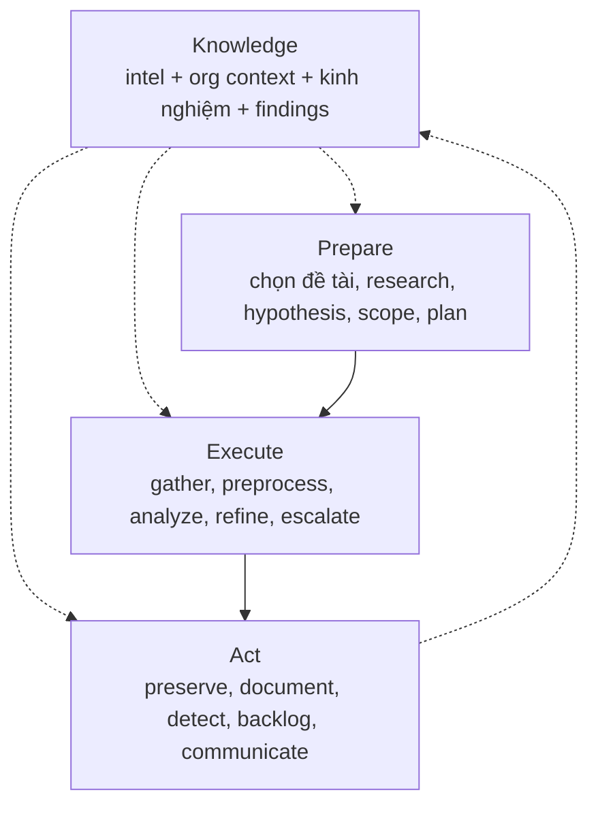

# PEAK Threat Hunting Framework — Nghiên cứu & Đối chiếu trung thực

> Tài liệu nghiên cứu phục vụ báo cáo. Nguồn chính: Splunk SURGe (David Bianco, Ryan Fetterman) — series 7 bài PEAK 2023 + repo content `Cisco-Talos/PEAK`.
> **Lập trường:** PEAK vẫn là quy trình của Splunk SURGe cho analyst. Kho này không nhận chứng nhận PEAK của Splunk. Đường hunt PoC giờ **chạy** bốn cửa của quy trình đó: Prepare bắt buộc trước khi query, Execute analyze → refine → IR, Act có kiểm tra SPL và backlog, và nhánh cũ gọi là M-ATH dùng API LLM trong `.env` thay cho model train tại chỗ.

## 1. Tóm tắt điều hành (Executive Summary)

- **PEAK = Prepare, Execute, and Act with Knowledge.** Framework săn tìm mối đe dọa hiện đại của Splunk SURGe, thay thế các framework cũ Sqrrl (2015) và TaHiTI (2018). **Bản chất: quy trình cho analyst con người** (mở Splunk, đọc log, viết detection) — không phải spec kiến trúc phần mềm.
- PEAK định nghĩa **3 loại hunt**: (1) Hypothesis-Driven, (2) Baseline / EDA, (3) Model-Assisted (M-ATH) — tất cả chạy chung 3 phase **Prepare → Execute → Act**, với **Knowledge (K)** thấm vào mọi phase.
- Engine vẫn giữ contract, verification và trần chi phí — những thứ PEAK không quy định. Bốn cửa PEAK nằm trên đường PoC, không thay kiến trúc ClaimGraph.
- Prepare, Execute/Refine, Act và LLM API đã thành bước chạy được. Chi tiết và giới hạn ở Mục 7.

## 2. Nguồn tham khảo

| # | Nguồn | Nội dung dùng |
|---|---|---|
| 1 | [Introducing the PEAK Threat Hunting Framework](https://www.splunk.com/en_us/blog/security/peak-threat-hunting-framework.html) (Bianco, 04/2023) | Định nghĩa, 3 loại hunt, 3 phase, Knowledge |
| 2 | [Hypothesis-Driven Hunting with PEAK](https://www.splunk.com/en_us/blog/security/peak-hypothesis-driven-threat-hunting.html) (Bianco, 05/2023) | Tạo hypothesis, ABLE, chi tiết Prepare/Execute/Act |
| 3 | [Baseline Hunting with PEAK](https://www.splunk.com/en_us/blog/security/peak-baseline-hunting.html) (Bianco, 07/2023) | Data dictionary, distributions, outliers, gap analysis |
| 4 | [M-ATH with PEAK](https://www.splunk.com/en_us/blog/security/peak-framework-math-model-assisted-threat-hunting.html) (Fetterman, 05/2023) | 4 tiêu chí dùng ML, họ algorithm, ví dụ applied |
| 5 | [PEAK content repo (Cisco-Talos/PEAK)](https://github.com/splunk/peak) | Hunts mẫu: dictionary-DGA, cryptominers, similarity — minh chứng M-ATH |

> Lưu ý nguồn gốc: PEAK là của **Splunk SURGe**. Repo content hiện nằm dưới `Cisco-Talos/PEAK` do Cisco mua lại Splunk — khi trích dẫn nên ghi "Splunk SURGe PEAK (nay lưu tại Cisco-Talos)" để tránh nhầm thành framework của Cisco.

## 3. Tổng quan PEAK

**Định nghĩa hunt (giữ nguyên từ ngành):** mọi quy trình thủ công hoặc có máy hỗ trợ nhằm tìm incident mà automated detection bỏ sót. PEAK chuẩn hóa *cách làm* cho repeatable, chứ không thay đổi định nghĩa.

- **Knowledge (K):** threat intel, hiểu biết tổ chức/nghiệp vụ, kinh nghiệm hunter, và findings của chính hunt hiện tại (vòng lặp Act → K).
- **Linh hoạt:** được phép skip / reorder / add step theo từng hunt cụ thể.
- **Điểm khác biệt so với framework cũ:** quy trình hiện đại hóa từ kinh nghiệm thực chiến, content chuẩn hóa + ví dụ, hỗ trợ ML chính thức qua M-ATH, nhấn mạnh đo lường và đầu ra.

## 4. Hunt loại 1 — Hypothesis-Driven (truy đuổi theo giả thuyết)

Cách làm cổ điển: đặt giả thuyết về hoạt động adversary → dùng data xác nhận/bác bỏ.

### 4.1. Tạo hypothesis tốt (3 bước)

1. **Topic:** vùng quan tâm, chưa phải hypothesis (vd "data exfiltration").
2. **Testable:** phát biểu sao cho chứng minh/bác bỏ được (vd "...exfil qua DNS tunneling").
3. **Refine:** thu hẹp tiếp cho huntable (vd "...exfil *dữ liệu tài chính* qua DNS tunneling").

Hypothesis không bất biến — refine trong lúc hunt là bình thường.

### 4.2. ABLE — biến hypothesis thành kế hoạch hành động

| Chữ | Nghĩa | Ví dụ DNS exfil |
|---|---|---|
| **A**ctor | Ai đánh (được phép trống) | Không rõ actor cụ thể |
| **B**ehavior | TTP cụ thể, 1–2 mảnh | DNS tunneling |
| **L**ocation | Đánh ở đâu trong mạng | Máy + server phòng finance |
| **E**vidence | Cần source nào, trúng thì trông thế nào | DNS logs; query to/lạ, record type lạ, artifact tool tunneling |

### 4.3. Ba phase

- **Prepare:** Select Topic → Research (học TTP, detection gap, sample hunt, hỏi CTI) → Generate Hypothesis → Scope (system + data + timeframe + **max duration**, vd "3 ngày không ra thì dừng") → Plan (lấy data kiểu gì, analytic gì, ai làm gì).
- **Execute:** Gather Data → Pre-Process (convert format, normalize schema, loại record rác) → Analyze (least/most frequency, clustering, visualization) → Refine Hypothesis → **Escalate Critical Findings** ngay cho IR.
- **Act:** Preserve Hunt (wiki + link data + tool) → Document Findings (confirm/refute, gap, misconfig, incident) → **Create Detections** → Re-Add Topic to Backlog → Communicate Findings.

## 5. Hunt loại 2 — Baseline / EDA (vẽ chân dung "bình thường")

Mục đích: định nghĩa normal để soi deviation. Dùng khi onboard log source mới, vào môi trường mới (M&A, khách MSSP), hoặc dọn đường cho hypothesis/M-ATH.

- **Prepare:** Select Data Source (ưu tiên source team dùng nhiều) → Research (field, ý nghĩa, detection hiện tại, owner system) → Scope (group máy tương đồng; window **30–90 ngày** cho hầu hết source) → Plan.
- **Execute:** Gather → **Data Dictionary** (field name, description, data type, cách đọc value; type: numerical continuous/discrete, categorical nominal/ordinal, textual, date/time, boolean — chỉ cần field security-relevant) → **Review Distributions** (mean/median, top values, cardinality) → **Investigate Outliers** (stack counting/LFO, z-score ±2–3σ, isolation forest) → **Gap Analysis** (thiếu data hệ nào, parse sai field nào) → Identify Relationships (vd login theo giờ hành chính).
- **Act:** Preserve → **Document Baseline** (**ghi known-benign outliers** để lần sau khỏi điều tra lại) → Create Detections (cẩn thận: abnormal ≠ malicious) → Communicate (wiki chung, link từ SOC playbook).

## 6. Hunt loại 3 — M-ATH (Model-Assisted, "Sherlock gọi Watson")

Dùng algorithm tìm lead khi phương pháp đơn giản không đủ. Output: lead trực tiếp, enrichment, hoặc risk notable (Risk-Based Alerting).

### 6.1. Khi nào dùng (4 tiêu chí, số 1 bắt buộc)

1. Phương pháp đơn giản đã thử mà không đủ chính xác.
2. Label được benign/malicious (cho supervised classification).
3. Data high-volume / khó summarize (cho clustering, dimensionality reduction).
4. Identify event chắc nhưng classify khó → cần analyst-in-the-loop.

### 6.2. Họ algorithm & ví dụ applied

- **Classification** (supervised/deep learning): suspicious DNS TXT, DGA detection, **obfuscated PowerShell detection**.
- **Clustering** (unsupervised): JA3 signatures, IP similarity.
- **NLP / Time series / Anomaly detection:** risky SPL, suspicious process (RNN).
- Tooling trong hệ Splunk: MLTK, DSDL (Python data-science libs), toán tử `apply` để operationalize.

### 6.3. Ba phase (điểm khác so với 2 loại trên)

- **Prepare:** Select Topic → Research (literature, open model/code/dataset, gap) → Identify Datasets → Select Algorithms.
- **Execute:** Gather → Pre-Process (+encode, label) → **Develop Model** → **Refine** (tune hyperparameter) → **Apply** → **Analyze** (filter/stack trên output + enrich reputation; FP thì label lại ném về train) → Escalate.
- **Act:** Preserve (**cả trained model** + notebook) → Document → Create Detections/**Notables**/**Playbooks** (best-case thành detection định kỳ; thường model đi 80%, 20% còn lại đóng thành analyst-in-the-loop playbook) → Backlog → Communicate.

Kho này không train model cho bước đó. API trong `.env` là model pretrained. `--math` gửi mẫu hàng đã kéo, giữ lead khi giá trị nằm trong hàng, và không lưu weight cục bộ. Prefilter stdlib chỉ chạy khi API không được gọi.

## 7. Đối chiếu trung thực: ngôn ngữ PEAK vs bản chất kỹ thuật

> Cách đọc bảng: cột "Ngôn ngữ PEAK" là cách nói với SOC/manager; cột "Bản chất" là sự thật kỹ thuật để báo cáo không quá đà.

| Ngôn ngữ PEAK | Bản chất trong hệ thống này | Đánh giá |
|---|---|---|
| Hypothesis + ABLE + scope + plan | CLI từ chối chạy PoC khi thiếu topic, research, behavior, location, evidence, scope, max duration hoặc plan. Actor được để trống. `--prepare` hỏi tuần tự; `--hunt-plan` đọc YAML/JSON (`configs/hunt_plan.example.yaml`). Compiler gắn ABLE thành `SemanticConstraint` trên anchor. Token cụ thể (file, flag, IP, chuỗi trích dẫn, host có chữ số, `DOMAIN\user`) được AND vào `search_text`. `max_duration` cắt cửa sổ telemetry về cạnh cuối và là hạn của pass refine. | Prepare là cửa chạy được. Văn xuôi không có token cụ thể không trở thành predicate. |
| Execute: gather → analyze → refine → escalate | `PocAgent` chạy pass 1, ghi analyze, rồi tối đa một pass refine: siết các step còn lại vào đúng một host của step khớp đầu, hoặc khi rỗng thì chạy fallback rồi chạy lại predicate gốc **không nới operator**. Finding khớp, hoặc narrative LLM khi rỗng, ghi `artifacts/poc_hunts/ir/<id>.json`. `HypothesisHuntEngine` ghi cùng quyết định analyze/refine/IR vào `peak_execute_log` và không mở thêm một query không trần. | Vòng refine có thật trên PoC. Engine không tự bắn query refine thứ hai. |
| Baseline survey (EDA) | `--baseline` giữ EDA deterministic. Act của baseline đi qua `commit_act` (backlog + stakeholder). Window demo vẫn có thể ngắn hơn 30–90 ngày PEAK khuyên. | EDA giữ nguyên; Act đã có store. |
| M-ATH qua API LLM | `--math` gửi mẫu hàng tới API LLM trong `.env`. Lead chỉ được giữ khi `value` xuất hiện trong hàng đã kéo. Không train model tại chỗ. `--llm stub` hoặc API lỗi thì prefilter stdlib chạy và bị ghi `heuristic_prefilter` / `api_llm_ungrounded_fallback`, không gọi là model đã train. | Đây là model pretrained có sẵn, không phải M-ATH train/tune cục bộ. |
| Act: detection + backlog + communicate | `validate_spl` kiểm tra SPL đọc-only. Khi provider là Splunk, `SplunkLiveAdapter.validate_spl` gọi `POST /services/search/parser` và không chạy search. Trạng thái: `VALIDATED`, `DRAFT` (chưa parse được live), `INVALID`. Backlog nối thêm `artifacts/backlog/backlog.jsonl`. Stakeholder ghi `artifacts/act/<id>/stakeholder.md`. | Detection engineering có kiểm tra parser. Parser không chứng minh detection ít false positive. |
| Knowledge | MITRE refs + research_refs + PoC library + ledger (`baselines/`, `models/math_runs/`, `artifacts/poc_hunts/`, `artifacts/backlog/`) | Chưa phải kho intel tổ chức. |

**Điểm khớp thật (giữ lại khi báo cáo):** hypothesis testable, preserve/document bằng ledger + report, knowledge tích lũy qua PoC library, analyst-in-the-loop (rules bắt signal, LLM chỉ advisory).

**Giới hạn còn lại (nói đúng khi báo cáo):**

1. ABLE chỉ lái query bằng token cụ thể. Một câu behavior không có file, flag, IP, host hay account không thêm predicate.
2. Baseline demo vẫn có thể là một ngày, chưa phải cửa sổ 30–90 ngày.
3. Refine không nới `EQUALS` thành `CONTAINS`. Pass thứ hai chỉ siết host hoặc chạy lại predicate gốc.
4. `VALIDATED` nghĩa là parser Splunk chấp nhận cú pháp. Nó không phải detection đã phát hành.

## 8. Trạng thái triển khai

1. **Prepare.** `--prepare` hoặc `--hunt-plan`. PoC JSON cũ vẫn load; lần chạy với `enforce_prepare` dừng nếu thiếu trường. Schema ở `poc/models.py`, compiler ở `poc/compiler.py`, cửa ở `cli.py` và `hunting/peak.py`.
2. **Execute.** `PocAgent._execute_loop` và `HypothesisHuntEngine` (ghi `peak_execute_log` / `peak_ir_escalation`). IR file dưới `artifacts/poc_hunts/ir/`.
3. **Act.** `hunting.act.commit_act` + `SplunkLiveAdapter.validate_spl`.
4. **LLM thay M-ATH.** `mathunt.run_math(..., llm_caller=...)`. CLI `--math` lấy caller từ `.env` khi `--llm api`.
5. **Baseline** giữ EDA không LLM, rồi cùng `commit_act`.

## 9. Kết luận

Đường PoC đi qua Prepare, một vòng refine, IR và Act có kiểm tra SPL. Nhánh `--math` dùng API LLM đã cấu hình, không train model cục bộ. PEAK không thay contract bằng chứng: match literal, judge và narrative LLM vẫn là advisory.

## 10. Giá trị kỹ thuật thật của hệ thống (dùng khi báo cáo sếp)

Những thứ PEAK không quy định nhưng SOC nào cũng cần — và repo này có:

1. **Deterministic matching:** cùng PoC + cùng dữ liệu = cùng output, tái chạy/audit được. LLM không tham gia match.
2. **Bounded LLM:** LLM chỉ fire ở 2 điểm có trần (escalation khi EMPTY, judge TP/FP khi MATCHED), có đếm call/token/USD tách riêng match vs judge.
3. **Verification & completeness:** limit+1 EOF proof, typed contracts, observation append-only có citation — không phát biểu vượt evidence.
4. **Chi phí đo được:** mỗi run ghi ledger JSON + report. LLM API chỉ được gọi ở judge, escalation khi rỗng, và `--math` khi `--llm api`.

PEAK ở kho này là cửa quy trình trên đường PoC. Contract bằng chứng và trần LLM không bị thay bằng văn xuôi của framework.
