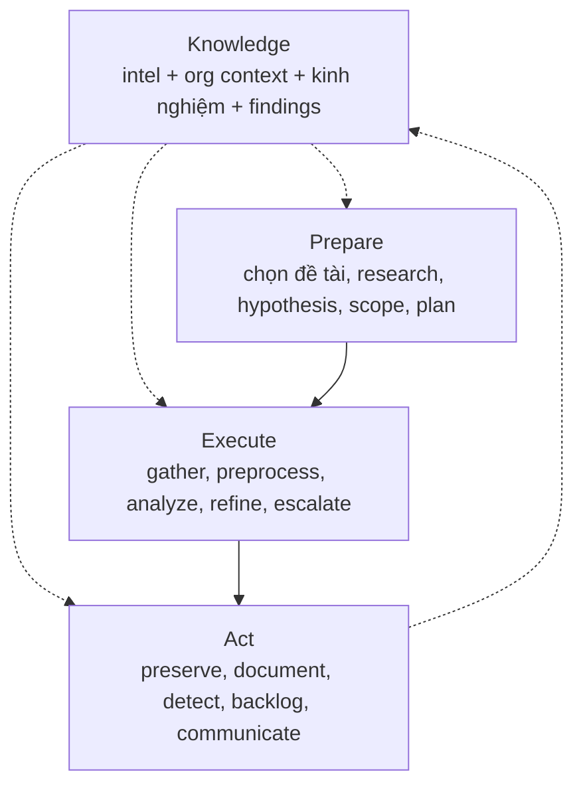

# PEAK Threat Hunting Framework — Nghiên cứu & Đối chiếu trung thực

> Tài liệu nghiên cứu phục vụ báo cáo. Nguồn chính: Splunk SURGe (David Bianco, Ryan Fetterman) — series 7 bài PEAK 2023 + repo content `Cisco-Talos/PEAK`.
> **Lập trường của tài liệu này (quan trọng khi báo cáo): PEAK là framework quy trình cho analyst con người, không phải kiến trúc phần mềm. Hệ thống này KHÔNG claim PEAK-compliant — chỉ mượn ngôn ngữ PEAK (ABLE, baseline survey, Act) để trình bày cho SOC/manager dễ hiểu. Giá trị kỹ thuật thật nằm ở tính deterministic, bounded-LLM và reproducibility (Mục 10).**

## 1. Tóm tắt điều hành (Executive Summary)

- **PEAK = Prepare, Execute, and Act with Knowledge.** Framework săn tìm mối đe dọa hiện đại của Splunk SURGe, thay thế các framework cũ Sqrrl (2015) và TaHiTI (2018). **Bản chất: quy trình cho analyst con người** (mở Splunk, đọc log, viết detection) — không phải spec kiến trúc phần mềm.
- PEAK định nghĩa **3 loại hunt**: (1) Hypothesis-Driven, (2) Baseline / EDA, (3) Model-Assisted (M-ATH) — tất cả chạy chung 3 phase **Prepare → Execute → Act**, với **Knowledge (K)** thấm vào mọi phase.
- Hệ thống này là **engine tự động** (contracts, verification, cost bound, completeness proof) — những thứ PEAK không quy định. Vì vậy mapping dưới đây là **tham khảo ngôn ngữ trình bày, không phải tuân thủ framework**.
- Những gì đã làm theo ngôn ngữ PEAK: PoC mang hunt-plan ABLE (metadata báo cáo, không lái query), baseline survey EDA, heuristic lead scoring, Act (SPL draft + backlog + stakeholder) — chi tiết ở Mục 7.

## 2. Nguồn tham khảo

| # | Nguồn | Nội dung dùng |
|---|---|---|
| 1 | [Introducing the PEAK Threat Hunting Framework](https://www.splunk.com/en_us/blog/security/peak-threat-hunting-framework.html) (Bianco, 04/2023) | Định nghĩa, 3 loại hunt, 3 phase, Knowledge |
| 2 | [Hypothesis-Driven Hunting with PEAK](https://www.splunk.com/en_us/blog/security/peak-hypothesis-driven-threat-hunting.html) (Bianco, 05/2023) | Tạo hypothesis, ABLE, chi tiết Prepare/Execute/Act |
| 3 | [Baseline Hunting with PEAK](https://www.splunk.com/en_us/blog/security/peak-baseline-hunting.html) (Bianco, 07/2023) | Data dictionary, distributions, outliers, gap analysis |
| 4 | [M-ATH with PEAK](https://www.splunk.com/en_us/blog/security/peak-framework-math-model-assisted-threat-hunting.html) (Fetterman, 05/2023) | 4 tiêu chí dùng ML, họ algorithm, ví dụ applied |
| 5 | [PEAK content repo (Cisco-Talos/PEAK)](https://github.com/splunk/peak) | Hunts mẫu: dictionary-DGA, cryptominers, similarity — minh chứng M-ATH |

> Lưu ý nguồn gốc: PEAK là của **Splunk SURGe**. Repo content hiện nằm dưới `Cisco-Talos/PEAK` do Cisco mua lại Splunk — khi trích dẫn nên ghi "Splunk SURGe PEAK (nay lưu tại Cisco-Talos)" để tránh nhầm thành framework của Cisco.

## 3. Tổng quan PEAK

**Định nghĩa hunt (giữ nguyên từ ngành):** mọi quy trình thủ công hoặc có máy hỗ trợ nhằm tìm incident mà automated detection bỏ sót. PEAK chuẩn hóa *cách làm* cho repeatable, chứ không thay đổi định nghĩa.

- **Knowledge (K):** threat intel, hiểu biết tổ chức/nghiệp vụ, kinh nghiệm hunter, và findings của chính hunt hiện tại (vòng lặp Act → K).
- **Linh hoạt:** được phép skip / reorder / add step theo từng hunt cụ thể.
- **Điểm khác biệt so với framework cũ:** quy trình hiện đại hóa từ kinh nghiệm thực chiến, content chuẩn hóa + ví dụ, hỗ trợ ML chính thức qua M-ATH, nhấn mạnh đo lường và đầu ra.

## 4. Hunt loại 1 — Hypothesis-Driven (truy đuổi theo giả thuyết)

Cách làm cổ điển: đặt giả thuyết về hoạt động adversary → dùng data xác nhận/bác bỏ.

### 4.1. Tạo hypothesis tốt (3 bước)

1. **Topic:** vùng quan tâm, chưa phải hypothesis (vd "data exfiltration").
2. **Testable:** phát biểu sao cho chứng minh/bác bỏ được (vd "...exfil qua DNS tunneling").
3. **Refine:** thu hẹp tiếp cho huntable (vd "...exfil *dữ liệu tài chính* qua DNS tunneling").

Hypothesis không bất biến — refine trong lúc hunt là bình thường.

### 4.2. ABLE — biến hypothesis thành kế hoạch hành động

| Chữ | Nghĩa | Ví dụ DNS exfil |
|---|---|---|
| **A**ctor | Ai đánh (được phép trống) | Không rõ actor cụ thể |
| **B**ehavior | TTP cụ thể, 1–2 mảnh | DNS tunneling |
| **L**ocation | Đánh ở đâu trong mạng | Máy + server phòng finance |
| **E**vidence | Cần source nào, trúng thì trông thế nào | DNS logs; query to/lạ, record type lạ, artifact tool tunneling |

### 4.3. Ba phase

- **Prepare:** Select Topic → Research (học TTP, detection gap, sample hunt, hỏi CTI) → Generate Hypothesis → Scope (system + data + timeframe + **max duration**, vd "3 ngày không ra thì dừng") → Plan (lấy data kiểu gì, analytic gì, ai làm gì).
- **Execute:** Gather Data → Pre-Process (convert format, normalize schema, loại record rác) → Analyze (least/most frequency, clustering, visualization) → Refine Hypothesis → **Escalate Critical Findings** ngay cho IR.
- **Act:** Preserve Hunt (wiki + link data + tool) → Document Findings (confirm/refute, gap, misconfig, incident) → **Create Detections** → Re-Add Topic to Backlog → Communicate Findings.

## 5. Hunt loại 2 — Baseline / EDA (vẽ chân dung "bình thường")

Mục đích: định nghĩa normal để soi deviation. Dùng khi onboard log source mới, vào môi trường mới (M&A, khách MSSP), hoặc dọn đường cho hypothesis/M-ATH.

- **Prepare:** Select Data Source (ưu tiên source team dùng nhiều) → Research (field, ý nghĩa, detection hiện tại, owner system) → Scope (group máy tương đồng; window **30–90 ngày** cho hầu hết source) → Plan.
- **Execute:** Gather → **Data Dictionary** (field name, description, data type, cách đọc value; type: numerical continuous/discrete, categorical nominal/ordinal, textual, date/time, boolean — chỉ cần field security-relevant) → **Review Distributions** (mean/median, top values, cardinality) → **Investigate Outliers** (stack counting/LFO, z-score ±2–3σ, isolation forest) → **Gap Analysis** (thiếu data hệ nào, parse sai field nào) → Identify Relationships (vd login theo giờ hành chính).
- **Act:** Preserve → **Document Baseline** (**ghi known-benign outliers** để lần sau khỏi điều tra lại) → Create Detections (cẩn thận: abnormal ≠ malicious) → Communicate (wiki chung, link từ SOC playbook).

## 6. Hunt loại 3 — M-ATH (Model-Assisted, "Sherlock gọi Watson")

Dùng algorithm tìm lead khi phương pháp đơn giản không đủ. Output: lead trực tiếp, enrichment, hoặc risk notable (Risk-Based Alerting).

### 6.1. Khi nào dùng (4 tiêu chí, số 1 bắt buộc)

1. Phương pháp đơn giản đã thử mà không đủ chính xác.
2. Label được benign/malicious (cho supervised classification).
3. Data high-volume / khó summarize (cho clustering, dimensionality reduction).
4. Identify event chắc nhưng classify khó → cần analyst-in-the-loop.

### 6.2. Họ algorithm & ví dụ applied

- **Classification** (supervised/deep learning): suspicious DNS TXT, DGA detection, **obfuscated PowerShell detection**.
- **Clustering** (unsupervised): JA3 signatures, IP similarity.
- **NLP / Time series / Anomaly detection:** risky SPL, suspicious process (RNN).
- Tooling trong hệ Splunk: MLTK, DSDL (Python data-science libs), toán tử `apply` để operationalize.

### 6.3. Ba phase (điểm khác so với 2 loại trên)

- **Prepare:** Select Topic → Research (literature, open model/code/dataset, gap) → Identify Datasets → Select Algorithms.
- **Execute:** Gather → Pre-Process (+encode, label) → **Develop Model** → **Refine** (tune hyperparameter) → **Apply** → **Analyze** (filter/stack trên output + enrich reputation; FP thì label lại ném về train) → Escalate.
- **Act:** Preserve (**cả trained model** + notebook) → Document → Create Detections/**Notables**/**Playbooks** (best-case thành detection định kỳ; thường model đi 80%, 20% còn lại đóng thành analyst-in-the-loop playbook) → Backlog → Communicate.

## 7. Đối chiếu trung thực: ngôn ngữ PEAK vs bản chất kỹ thuật

> Cách đọc bảng: cột "Ngôn ngữ PEAK" là cách nói với SOC/manager; cột "Bản chất" là sự thật kỹ thuật để báo cáo không quá đà.

| Ngôn ngữ PEAK | Bản chất trong hệ thống này | Đánh giá |
|---|---|---|
| Hypothesis + ABLE + scope + plan | PoC schema có `topic`, `able{actor,behavior,location,evidence}`, `research_refs`, `scope`, `max_duration`, `plan`; compiler đưa ABLE vào graph assumptions; report có mục "Hunt Plan (ABLE)". **ABLE là metadata báo cáo — không tham gia quyết định query (match vẫn literal LIKE).** | Dùng được để trình bày; không claim "Prepare automation" |
| Execute: gather → analyze → refine → escalate | `PocAgent`: `search_text` qua adapter → MATCHED/EMPTY → LLM judge (advisory). Không có preprocess/normalize, không vòng refine tự động, không escalate-to-IR | Engine检索 + judge, không phải Execute loop của PEAK |
| Baseline survey (EDA) | `--baseline cdb:events`: Gather (bounded SQL, limit+1 truncation flag) → Data Dictionary → Distributions → Outliers (stack counting + z-score) → Gap Analysis → Relationships → Preserve (`baselines/*.json`) + Document. Không LLM. **Window demo chỉ 1 ngày (PEAK khuyến nghị 30–90d), chưa có known-benign list** | Công cụ EDA đúng nghĩa nhưng ở quy mô demo |
| Heuristic lead scoring (đừng gọi là M-ATH) | `--math cdb:events`: rare_value (frequency), lexical (encoded/hidden/cradle/persistence/cred-tool + entropy), rare_sequence (parent→child, user::image), dga heuristic. Ranked leads → `models/math_runs/`. **Không numpy/sklearn, không train/tune/apply model — là heuristics, không phải ML.** Judge TP/FP giữ vai trò advisory phía sau | Gọi là "heuristic lead scoring", **không claim M-ATH/ML** |
| Act: preserve → document → detection draft → backlog → communicate | Shared `hunting.act` (pure functions, không LLM): SPL draft từ PoC steps / lead / outlier (**đánh dấu DRAFT, chưa validate trên Splunk thật**), backlog, stakeholder summary. Cả 3 report đều có mục `## Act (...)` | Draft để analyst review, không phải detection engineering |
| Knowledge | MITRE refs + research_refs + PoC library + ledger 3 tầng (`baselines/`, `models/math_runs/`, `artifacts/poc_hunts/`) | Tích lũy artifact tốt; chưa phải intel/org-context store |

**Điểm khớp thật (giữ lại khi báo cáo):** hypothesis testable, preserve/document bằng ledger + report, knowledge tích lũy qua PoC library, analyst-in-the-loop (rules bắt signal, LLM chỉ advisory).

**Điểm gượng ép (đã gỡ claim trong code — chi tiết giữ ở đây để trung thực):**

1. ABLE chỉ là metadata trình bày, engine không dùng để ra quyết định.
2. Baseline demo 16 rows/1 ngày, chưa phải baseline 30–90 ngày.
3. Module scoring là heuristics stdlib — đã đổi tên CLI/docstring, không gọi là M-ATH/ML.
4. SPL draft nối chuỗi, chưa validate trên Splunk thật.

## 8. Trạng thái triển khai (không phá code cũ)

1. ✅ **PoC schema += hunt-plan ABLE (tương thích ngược).**
2. ✅ **Baseline survey:** `--baseline cdb:events [--baseline-fields ...] [--baseline-limit N] [--baseline-rare N]` — deterministic, không LLM; lưu `baselines/<id>.json` (gitignored) + report `.md`.
3. ✅ **Heuristic lead scoring:** `--math cdb:events [--math-detectors ...] [--math-min-score X]` — 4 stdlib heuristics, ranked leads, không thêm dependency, không LLM; lưu `models/math_runs/`.
4. ✅ **Act:** shared `src/hunting/act/` — SPL draft + backlog + stakeholder summary cho cả 3 loại run, pure functions không LLM, đánh dấu DRAFT cần analyst review.
5. **Knowledge store versioned:** `pocs/` + `baselines/` + `models/` — ledger đã trỏ đúng phiên bản dùng; còn thiếu intel ingest và org context.

## 9. Kết luận

PEAK là khung ngôn ngữ tốt để nói chuyện với SOC/manager (hypothesis testable, baseline, act có đầu ra), nhưng không phải kiến trúc cho engine tự động. Hệ thống này dùng ngôn ngữ PEAK để trình bày, và giữ giá trị kỹ thuật thật ở chỗ khác (Mục 10).

## 10. Giá trị kỹ thuật thật của hệ thống (dùng khi báo cáo sếp)

Những thứ PEAK không quy định nhưng SOC nào cũng cần — và repo này có:

1. **Deterministic matching:** cùng PoC + cùng dữ liệu = cùng output, tái chạy/audit được. LLM không tham gia match.
2. **Bounded LLM:** LLM chỉ fire ở 2 điểm có trần (escalation khi EMPTY, judge TP/FP khi MATCHED), có đếm call/token/USD tách riêng match vs judge.
3. **Verification & completeness:** limit+1 EOF proof, typed contracts, observation append-only có citation — không phát biểu vượt evidence.
4. **Chi phí & reproducibility đo được:** mỗi run ghi ledger JSON + report, full suite hiện tại 514 passed.

Roadmap kỹ thuật nên quay về core: contracts, verification, Splunk live adapter, dataset thật dài ngày — PEAK giữ lại làm chương "mapping truyền thông" (tài liệu này), không làm blueprint refactor.
