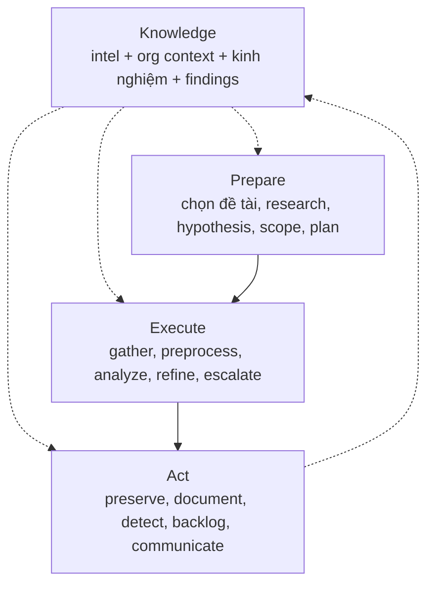

# PEAK Threat Hunting Framework — Nghiên cứu & Đối chiếu hệ thống hiện tại

> Tài liệu nghiên cứu phục vụ báo cáo. Nguồn chính: Splunk SURGe (David Bianco, Ryan Fetterman) — series 7 bài PEAK 2023 + repo content `Cisco-Talos/PEAK`.
> Trạng thái: nghiên cứu đối chiếu, chưa triển khai code.

## 1. Tóm tắt điều hành (Executive Summary)

- **PEAK = Prepare, Execute, and Act with Knowledge.** Framework săn tìm mối đe dọa hiện đại của Splunk SURGe, thay thế các framework cũ Sqrrl (2015) và TaHiTI (2018).
- PEAK định nghĩa **3 loại hunt**: (1) Hypothesis-Driven, (2) Baseline / EDA, (3) Model-Assisted (M-ATH) — tất cả chạy chung 3 phase **Prepare → Execute → Act**, với **Knowledge (K)** thấm vào mọi phase.
- Hệ thống hiện tại của nhóm đã đi đúng hướng PEAK ở mảng **Hypothesis-Driven**: PoC có cấu trúc + match deterministic + LLM chỉ làm judge (advisory). Còn thiếu 2 mảng: **Baseline hunts** và **M-ATH**, và thiếu khâu **Act** (sinh detection, backlog).
- Đề xuất: bổ sung ABLE vào PoC schema, thêm Baseline mode, thêm M-ATH lite, hoàn thiện khâu Act — chi tiết ở Mục 6.

## 2. Nguồn tham khảo

| # | Nguồn | Nội dung dùng |
|---|---|---|
| 1 | [Introducing the PEAK Threat Hunting Framework](https://www.splunk.com/en_us/blog/security/peak-threat-hunting-framework.html) (Bianco, 04/2023) | Định nghĩa, 3 loại hunt, 3 phase, Knowledge |
| 2 | [Hypothesis-Driven Hunting with PEAK](https://www.splunk.com/en_us/blog/security/peak-hypothesis-driven-threat-hunting.html) (Bianco, 05/2023) | Tạo hypothesis, ABLE, chi tiết Prepare/Execute/Act |
| 3 | [Baseline Hunting with PEAK](https://www.splunk.com/en_us/blog/security/peak-baseline-hunting.html) (Bianco, 07/2023) | Data dictionary, distributions, outliers, gap analysis |
| 4 | [M-ATH with PEAK](https://www.splunk.com/en_us/blog/security/peak-framework-math-model-assisted-threat-hunting.html) (Fetterman, 05/2023) | 4 tiêu chí dùng ML, họ algorithm, ví dụ applied |
| 5 | [PEAK content repo (Cisco-Talos/PEAK)](https://github.com/splunk/peak) | Hunts mẫu: dictionary-DGA, cryptominers, similarity — minh chứng M-ATH |

> Lưu ý nguồn gốc: PEAK là của **Splunk SURGe**. Repo content hiện nằm dưới `Cisco-Talos/PEAK` do Cisco mua lại Splunk — khi trích dẫn nên ghi "Splunk SURGe PEAK (nay lưu tại Cisco-Talos)" để tránh nhầm thành framework của Cisco.

## 3. Tổng quan PEAK

**Định nghĩa hunt (giữ nguyên từ ngành):** mọi quy trình thủ công hoặc có máy hỗ trợ nhằm tìm incident mà automated detection bỏ sót. PEAK chuẩn hóa *cách làm* cho repeatable, chứ không thay đổi định nghĩa.

- **Knowledge (K):** threat intel, hiểu biết tổ chức/nghiệp vụ, kinh nghiệm hunter, và findings của chính hunt hiện tại (vòng lặp Act → K).
- **Linh hoạt:** được phép skip / reorder / add step theo từng hunt cụ thể.
- **Điểm khác biệt so với framework cũ:** quy trình hiện đại hóa từ kinh nghiệm thực chiến, content chuẩn hóa + ví dụ, hỗ trợ ML chính thức qua M-ATH, nhấn mạnh đo lường và đầu ra.

## 4. Hunt loại 1 — Hypothesis-Driven (truy đuổi theo giả thuyết)

Cách làm cổ điển: đặt giả thuyết về hoạt động adversary → dùng data xác nhận/bác bỏ.

### 4.1. Tạo hypothesis tốt (3 bước)

1. **Topic:** vùng quan tâm, chưa phải hypothesis (vd "data exfiltration").
2. **Testable:** phát biểu sao cho chứng minh/bác bỏ được (vd "...exfil qua DNS tunneling").
3. **Refine:** thu hẹp tiếp cho huntable (vd "...exfil *dữ liệu tài chính* qua DNS tunneling").

Hypothesis không bất biến — refine trong lúc hunt là bình thường.

### 4.2. ABLE — biến hypothesis thành kế hoạch hành động

| Chữ | Nghĩa | Ví dụ DNS exfil |
|---|---|---|
| **A**ctor | Ai đánh (được phép trống) | Không rõ actor cụ thể |
| **B**ehavior | TTP cụ thể, 1–2 mảnh | DNS tunneling |
| **L**ocation | Đánh ở đâu trong mạng | Máy + server phòng finance |
| **E**vidence | Cần source nào, trúng thì trông thế nào | DNS logs; query to/lạ, record type lạ, artifact tool tunneling |

### 4.3. Ba phase

- **Prepare:** Select Topic → Research (học TTP, detection gap, sample hunt, hỏi CTI) → Generate Hypothesis → Scope (system + data + timeframe + **max duration**, vd "3 ngày không ra thì dừng") → Plan (lấy data kiểu gì, analytic gì, ai làm gì).
- **Execute:** Gather Data → Pre-Process (convert format, normalize schema, loại record rác) → Analyze (least/most frequency, clustering, visualization) → Refine Hypothesis → **Escalate Critical Findings** ngay cho IR.
- **Act:** Preserve Hunt (wiki + link data + tool) → Document Findings (confirm/refute, gap, misconfig, incident) → **Create Detections** → Re-Add Topic to Backlog → Communicate Findings.

## 5. Hunt loại 2 — Baseline / EDA (vẽ chân dung "bình thường")

Mục đích: định nghĩa normal để soi deviation. Dùng khi onboard log source mới, vào môi trường mới (M&A, khách MSSP), hoặc dọn đường cho hypothesis/M-ATH.

- **Prepare:** Select Data Source (ưu tiên source team dùng nhiều) → Research (field, ý nghĩa, detection hiện tại, owner system) → Scope (group máy tương đồng; window **30–90 ngày** cho hầu hết source) → Plan.
- **Execute:** Gather → **Data Dictionary** (field name, description, data type, cách đọc value; type: numerical continuous/discrete, categorical nominal/ordinal, textual, date/time, boolean — chỉ cần field security-relevant) → **Review Distributions** (mean/median, top values, cardinality) → **Investigate Outliers** (stack counting/LFO, z-score ±2–3σ, isolation forest) → **Gap Analysis** (thiếu data hệ nào, parse sai field nào) → Identify Relationships (vd login theo giờ hành chính).
- **Act:** Preserve → **Document Baseline** (**ghi known-benign outliers** để lần sau khỏi điều tra lại) → Create Detections (cẩn thận: abnormal ≠ malicious) → Communicate (wiki chung, link từ SOC playbook).

## 6. Hunt loại 3 — M-ATH (Model-Assisted, "Sherlock gọi Watson")

Dùng algorithm tìm lead khi phương pháp đơn giản không đủ. Output: lead trực tiếp, enrichment, hoặc risk notable (Risk-Based Alerting).

### 6.1. Khi nào dùng (4 tiêu chí, số 1 bắt buộc)

1. Phương pháp đơn giản đã thử mà không đủ chính xác.
2. Label được benign/malicious (cho supervised classification).
3. Data high-volume / khó summarize (cho clustering, dimensionality reduction).
4. Identify event chắc nhưng classify khó → cần analyst-in-the-loop.

### 6.2. Họ algorithm & ví dụ applied

- **Classification** (supervised/deep learning): suspicious DNS TXT, DGA detection, **obfuscated PowerShell detection**.
- **Clustering** (unsupervised): JA3 signatures, IP similarity.
- **NLP / Time series / Anomaly detection:** risky SPL, suspicious process (RNN).
- Tooling trong hệ Splunk: MLTK, DSDL (Python data-science libs), toán tử `apply` để operationalize.

### 6.3. Ba phase (điểm khác so với 2 loại trên)

- **Prepare:** Select Topic → Research (literature, open model/code/dataset, gap) → Identify Datasets → Select Algorithms.
- **Execute:** Gather → Pre-Process (+encode, label) → **Develop Model** → **Refine** (tune hyperparameter) → **Apply** → **Analyze** (filter/stack trên output + enrich reputation; FP thì label lại ném về train) → Escalate.
- **Act:** Preserve (**cả trained model** + notebook) → Document → Create Detections/**Notables**/**Playbooks** (best-case thành detection định kỳ; thường model đi 80%, 20% còn lại đóng thành analyst-in-the-loop playbook) → Backlog → Communicate.

## 7. Đối chiếu với hệ thống hiện tại (cập nhật sau refactor ABLE)

| PEAK yêu cầu | Hệ thống hiện tại | Đánh giá |
|---|---|---|
| Hypothesis + ABLE + scope + plan | PoC schema đã có `topic`, `able{actor,behavior,location,evidence}`, `research_refs`, `scope`, `max_duration`, `plan` — 4 PoC built-in + 3 PoC JSON BOTS v1 đều điền đủ; compiler đưa ABLE vào graph assumptions; report có mục "PEAK Prepare (ABLE)" | **Đạt ~90%.** ABLE actor được phép trống (unknown actor hợp lệ theo PEAK) |
| Execute: gather → preprocess → analyze → refine → escalate | `PocAgent`: `search_text` qua adapter → MATCHED/EMPTY → LLM judge | **Đạt 60%.** Thiếu preprocess/normalize, vòng refine, escalate-to-IR |
| Baseline hunts | Chưa có | **Chưa có.** Thiếu data dictionary, distributions, outlier detection |
| M-ATH | Judge hiện tại là LLM-as-judge TP/FP (advisory), không phải hunting model | **Chưa có M-ATH thật.** Chưa có clustering/anomaly sinh lead |
| Act: preserve → document → create detections → backlog → communicate | Ledger JSON + report `.md` trong `artifacts/poc_hunts/` (nay kèm ABLE + judge cost tách riêng) | **Đạt ~60%.** Thiếu sinh SPL draft, backlog, stakeholder summary |
| Knowledge thấm mọi phase | MITRE refs + research_refs + PoC library + ledger (graph assumptions giữ ABLE) | **Đạt ~65%.** Thiếu intel ingest, org context, baseline/model store versioned |

**Điểm khớp triết lý (mạnh):** PEAK nhấn mạnh analyst-in-the-loop và "model đi 80%, người đóng 20%" — đúng dual-layer của hệ thống: rules bắt signal (deterministic, reproducible), LLM chỉ giải thích/adjudicate, match không phụ thuộc LLM.

## 8. Lộ trình align PEAK (không phá code cũ)

1. ✅ **PoC schema += ABLE (đã xong, tương thích ngược):** `topic`, `able{actor,behavior,location,evidence}`, `research_refs`, `scope`, `max_duration`, `plan` — optional; PoC JSON cũ không có các field này vẫn load bình thường. ABLE đi vào graph assumptions + mục "PEAK Prepare (ABLE)" trong report. Test: 494 passed.
2. **Baseline mode mới:** `--baseline-data-source <name>` sinh data dictionary + distributions + outliers (stack counting, z-score) từ CDB, lưu `baselines/` versioned.
3. **M-ATH lite:** clustering/cardinality trên CDB rows (rare cmdline, rare parent→child) để sinh lead; LLM vẫn chỉ classify TP/FP.
4. **Hoàn thiện Act:** report thêm detection draft (SPL), backlog suggestions, stakeholder summary.
5. **Knowledge store:** `pocs/` + `baselines/` + `models/` versioned, ledger trỏ tới đúng phiên bản dùng.

## 9. Kết luận

PEAK cho ta khung chuẩn công nghiệp để đặt hệ thống hiện tại vào: ta đã làm tốt trụ **Hypothesis-Driven**, cần bổ sung **Baseline** và **M-ATH**, và đóng vòng **Act**. Lộ trình trên giữ nguyên tính deterministic + đo chi phí đang có, đồng thời đưa sản phẩm lên ngang ngôn ngữ mà SOC/SOC-manager dùng khi đánh giá hunting capability.
