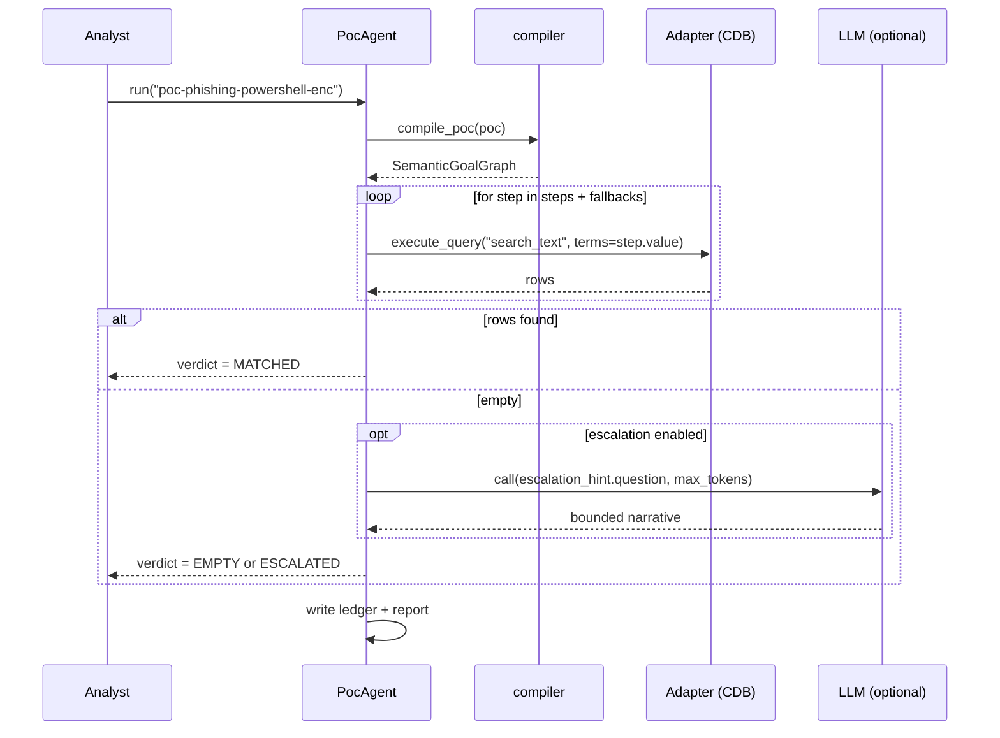

# Luồng sau khi sửa — PoC-driven Auto-Hunt

## 1. So sánh luồng cũ và luồng mới

### Luồng cũ (free-text `--hypothesis`)

```mermaid
graph TD
    A[Hypothesis text<br/>"Phishing email led to PowerShell execution on DESKTOP-VICTIM1"] --> B[Semantic Compiler<br/>LLM call]
    B --> C[SemanticGoalGraph]
    C --> D[Engine.execute_hunt<br/>plans + tests + verifies]
    D --> E[Markdown report]
```

Đặc điểm:
- Một câu tự do đi vào LLM để được "compile" thành graph.
- Graph phụ thuộc vào prompt của LLM — kém tái lập.
- Không có "PoC" rõ ràng; chỉ có "claim".
- Nếu LLM compile sai, cả quá trình đi theo hướng sai.

### Luồng mới (PoC-driven)

```mermaid
graph TD
    A[Analyst picks PoC<br/>--poc poc-phishing-powershell-enc] --> B[PoC compiler<br/>deterministic]
    B --> C[SemanticGoalGraph<br/>typed variables + relations + qualifiers]
    C --> D[PoC Agent<br/>runs TestSteps against adapter]
    D --> E{All empty?}
    E -- no --> F[Verdict: MATCHED<br/>+ ledger + report]
    E -- yes and --poc-allow-escalation --> G[LLM escalation<br/>bounded, optional]
    E -- yes no LLM --> H[Verdict: EMPTY]
    G --> F
```

Đặc điểm:
- Đầu vào là **PoC có cấu trúc**: id, steps với field/op/value cụ thể, fallbacks, MITRE references, escalation hint optional.
- Compiler **deterministic** — cùng PoC ra cùng graph.
- Agent chạy steps qua adapter (CDB, Splunk — bất kỳ adapter nào có `execute_query(operation_id="search_text", search_terms=...)`).
- LLM chỉ được gọi khi **adapter trả về rỗng** và user yêu cầu escalation.

## 2. Thiết kế PoC

Một PoC trong `src/hunting/poc/library.py`:

```python
PoC(
    poc_id="poc-phishing-powershell-enc",
    name="Phishing email led to PowerShell encoded command",
    kind=PocKind.TTP,                              # ttp | cve | ioc | behavior
    summary="Detect encoded PowerShell execution on a workstation.",
    steps=[
        TestStep(step_id="s1-powershell-enc",  description="...", target_field="image",  op=FieldOp.EQUALS,   value="powershell.exe"),
        TestStep(step_id="s2-powershell-hidden", description="...", target_field="cmdline", op=FieldOp.CONTAINS, value="-W Hidden"),
        TestStep(step_id="s3-powershell-encoded", description="...", target_field="cmdline", op=FieldOp.CONTAINS, value="-Enc"),
    ],
    fallbacks=[TestStep(...pwsh.exe...)],
    references=["MITRE ATT&CK T1059.001", "MITRE ATT&CK T1566"],
    escalation_hint=EscalationHint(
        question="If the encoded command hit was found, list parent/host/outbound in same minute.",
        max_tokens=2000,
    ),
)
```

Mỗi `TestStep` là **predicate cụ thể** mà adapter compile thành query native.
Mỗi PoC có MITRE refs để truy ngược khoa học.

## 3. Agent chạy PoC



## 4. CLI

```bash
# List PoCs
python main.py --list-pocs

# Run one PoC
python main.py --provider cdb --db data/cdb_sample.sqlite \
  --poc poc-phishing-powershell-enc \
  --time-window "2026-09-01T00:00:00Z/2026-09-02T00:00:00Z"

# Run multiple PoCs in a chain
python main.py --provider cdb --db data/cdb_sample.sqlite \
  --poc-chain "poc-phishing-powershell-enc,poc-c2-beacon"

# Allow LLM escalation (uses --llm api config)
python main.py --provider cdb --llm api --poc poc-phishing-powershell-enc \
  --poc-allow-escalation
```

## 5. Khoa học & chi phí

| Aspect | Luồng cũ | Luồng mới |
|---|---|---|
| Tái lập compile | Phụ thuộc LLM | Deterministic |
| Tái lập query | Phụ thuộc LLM planner | Adapter + literal search_terms |
| Số LLM call mỗi hunt | 1-3 (compile + planner + evaluator) | 0-1 (chỉ escalation khi rỗng) |
| Đo chi phí | Tracker có nhưng không tách riêng | Mỗi PoC ghi riêng llm_calls / tokens / USD |
| Ground truth | Không | Mỗi PoC có metadata → so sánh trực tiếp |

## 6. Đã thêm

```
src/hunting/poc/
├── __init__.py
├── models.py            # PoC, TestStep, FieldOp, PocKind, EscalationHint
├── library.py           # 4 PoCs: phishing-PS-enc, C2 beacon, office macro, cred phish
├── compiler.py          # PoC -> SemanticGoalGraph (deterministic)
├── agent.py             # PocAgent, PocHuntResult, StepResult
└── reporter.py          # render_poc_report -> markdown case-file

tests/unit/test_poc.py   # 9 unit tests covering: library, compile, agent, chain, report
```

CLI args:
```
--poc <id>               # run a single PoC
--poc-chain <id,id,...>  # run multiple PoCs sequentially
--list-pocs              # show all built-in PoCs
--poc-allow-escalation   # allow LLM call only when local adapter returns empty
--poc-report <path>      # override the markdown report path
```

Artifacts:
- `artifacts/poc_hunts/<request_id>.json` — machine-readable ledger
- `artifacts/poc_hunts/<request_id>.md` — analyst case-file

## 7. Test result

```
$ python main.py --provider cdb --db data/cdb_sample.sqlite \
    --poc poc-phishing-powershell-enc --time-window "2026-09-01T00:00:00Z/2026-09-02T00:00:00Z"

[*] Telemetry backend: Local CDB (data\cdb_sample.sqlite)

========================================================================
PoC poc-phishing-powershell-enc — verdict MATCHED — 3 obs,
3 matched step(s), 0 LLM call(s), 0.0006s
  Rationale: Matched 3 PoC step(s) with 3 observation(s).
  Ledger:    artifacts\poc_hunts\poc-poc-phishing-powershell-enc-20260911-091840.json
  Report:    artifacts\poc_hunts\poc-poc-phishing-powershell-enc-20260911-091840.md
```

All 478 unit + eval tests pass; branch is `poc-auto-hunt` (local only — push to remote was denied).
