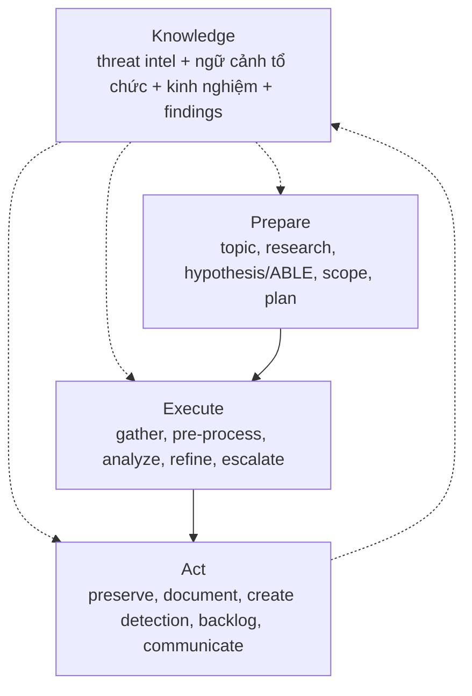

# Chương 3 — Khung PEAK của Splunk và cách hệ thống hiện thực hóa

> Chương này trình bày khung PEAK như một quy trình săn của ngành, rồi đối chiếu từng cửa của PEAK với thành phần kỹ thuật tương ứng trong kho, kèm ranh giới trung thực giữa "ngôn ngữ trình bày với SOC" và "bản chất kỹ thuật".

## 3.1. PEAK là gì

PEAK là khung săn mối đe dọa hiện đại của Splunk SURGe, giới thiệu bởi David Bianco và Ryan Fetterman năm 2023 [REF-PEAK], thay cho các khung cũ Sqrrl (2015) và TaHiTI (2018). Tên PEAK là chữ viết tắt của ba phase cộng một yếu tố xuyên suốt:

- **P**repare — chuẩn bị: chọn đề tài, nghiên cứu, phát biểu giả thuyết, xác định phạm vi và kế hoạch.
- **E**xecute — thực thi: thu thập, tiền xử lý, phân tích, tinh chỉnh giả thuyết, leo thang phát hiện nghiêm trọng.
- **A**ct — hành động: bảo tồn, tài liệu hóa, tạo detection, đưa vào backlog, truyền đạt.
- **K**nowledge — tri thức: threat intel, ngữ cảnh tổ chức, kinh nghiệm hunter, và chính findings của cuộc săn — thấm vào cả ba phase và được vòng lại qua Act.

**Bản chất PEAK là quy trình cho nhà phân tích con người** (mở Splunk, đọc log, viết detection), không phải một đặc tả kiến trúc phần mềm. Đây là điểm cần nói đúng khi báo cáo: kho này không phải là "một hiện thực PEAK được chứng nhận", mà là một hệ thống hiện thực hóa bốn cửa của quy trình đó.

## 3.2. Ba loại hunt của PEAK

PEAK định nghĩa ba loại hunt, cùng chạy qua ba phase Prepare → Execute → Act:

### 3.2.1. Hypothesis-Driven (theo giả thuyết)

Cách làm cổ điển: đặt giả thuyết về hoạt động kẻ địch rồi dùng dữ liệu xác nhận hoặc bác bỏ. PEAK khuyến nghị tạo giả thuyết tốt qua ba bước: chọn *topic* (vùng quan tâm, ví dụ "rò rỉ dữ liệu"), làm cho *testable* (ví dụ "rò rỉ qua DNS tunneling"), rồi *refine* cho huntable (ví dụ "rò rỉ dữ liệu tài chính qua DNS tunneling"). Giả thuyết không bất biến — tinh chỉnh trong lúc hunt là bình thường.

### 3.2.2. Baseline / EDA (khảo sát nền)

Mục đích: vẽ chân dung "bình thường" để soi lệch. Dùng khi onboard nguồn log mới, vào môi trường mới, hoặc dọn đường cho hypothesis/M-ATH. Các bước Execute đặc trưng: xây *data dictionary* (tên trường, mô tả, kiểu dữ liệu), xem *distributions* (mean/median, top values, cardinality), điều tra *outliers* (stack counting, z-score), phân tích *gaps* (nguồn thiếu, trường parse sai). PEAK khuyến nghị cửa sổ 30–90 ngày cho hầu hết nguồn.

### 3.2.3. M-ATH (Model-Assisted Threat Hunting)

Dùng thuật toán/mô hình để tìm lead khi phương pháp đơn giản không đủ. PEAK nêu bốn tiêu chí dùng ML (tiêu chí 1 bắt buộc): (1) phương pháp đơn giản đã thử mà không đủ chính xác; (2) có thể gán nhãn benign/malicious; (3) dữ liệu high-volume khó tóm tắt; (4) identify được nhưng classify khó → cần analyst-in-the-loop. Họ thuật toán gồm classification (ví dụ phát hiện PowerShell obfuscated), clustering, anomaly detection.

## 3.3. Mô hình ABLE

PEAK dùng mô hình **ABLE** để biến một giả thuyết thành kế hoạch hành động:

| Chữ | Nghĩa | Ví dụ (DNS exfil) |
|---|---|---|
| **A**ctor | Ai đánh (được phép trống) | Không rõ actor cụ thể |
| **B**ehavior | TTP cụ thể, 1–2 mảnh | DNS tunneling |
| **L**ocation | Đánh ở đâu trong mạng | Máy + server phòng tài chính |
| **E**vidence | Cần nguồn nào, trúng thì trông thế nào | DNS logs; query lạ, record type lạ |

## 3.4. Lập trường của kho về PEAK

Kho này **không nhận chứng nhận PEAK** của Splunk. Nó hiện thực hóa bốn cửa của quy trình PEAK và giữ nguyên những thứ PEAK không quy định: hợp đồng bằng chứng, kiểm chứng quan hệ, và trần chi phí LLM. Bốn cửa PEAK nằm trên đường PoC và (từ phiên bản này) trên mọi đường săn qua cổng Prepare bắt buộc; chúng không thay kiến trúc ba đồ thị.

## 3.5. Đối chiếu ngôn ngữ PEAK với bản chất kỹ thuật

> Cách đọc: cột "Ngôn ngữ PEAK" là cách trình bày với SOC/quản lý; cột "Bản chất" là sự thật kỹ thuật để báo cáo không quá đà.

| Ngôn ngữ PEAK | Bản chất trong hệ thống | Vị trí trong mã |
|---|---|---|
| Prepare: hypothesis + ABLE + scope + plan | Cổng bắt buộc từ chối chạy nếu thiếu topic, behavior, location, evidence, scope, max_duration, plan, research_refs. Actor được để trống. Token cụ thể trong ABLE (file, flag, IP, chuỗi trích dẫn, host có chữ số, `DOMAIN\user`) thành predicate; văn xuôi không thành predicate | `hunting/peak.py`, `hunting/cli.py`, `poc/compiler.py` |
| Execute: gather → analyze → refine → escalate | `PocAgent` chạy pass 1, ghi analyze, tối đa một pass refine (siết host hoặc chạy lại predicate gốc, không nới operator), rồi ghi gói IR khi có finding. Engine ghi cùng quyết định vào `peak_execute_log` mà không mở query không trần | `poc/agent.py`, `engine.py`, `peak.py` |
| Baseline / EDA | `--baseline` giữ EDA tất định (data dictionary, distribution, outlier, gap), rồi Act qua `commit_act` | `baseline/baseline.py`, `act/act.py` |
| M-ATH | `--math` gửi mẫu hàng tới API LLM trong `.env` (model pretrained, không train cục bộ); lead chỉ sống nếu giá trị nằm trong hàng đã kéo (grounding) | `mathunt/mathunt.py` |
| Act: detection + backlog + communicate | `validate_spl` kiểm SPL đọc-only; khi provider là Splunk, `POST /services/search/parser` kiểm cú pháp mà không chạy search; backlog append `backlog.jsonl`; stakeholder ghi Markdown | `act/act.py` |
| Knowledge | MITRE refs + research_refs + PoC library + ledger các lần chạy (`baselines/`, `models/math_runs/`, `artifacts/poc_hunts/`) | `compiler/knowledge_base.py`, `artifacts/` |

## 3.6. M-ATH: model pretrained ngoài thay cho train cục bộ

Điểm khác biệt quan trọng so với M-ATH kinh điển: M-ATH của PEAK giả định train/tune một mô hình ML tại chỗ. Kho này **không train model**. Cụ thể:

- `--math` gửi một mẫu hàng có giới hạn tới model pretrained qua API cấu hình trong `.env`.
- Lead do mô hình đề xuất chỉ được giữ khi giá trị của nó **xuất hiện thật trong hàng đã kéo** (grounding); lead bịa bị loại.
- Grep toàn kho `numpy|sklearn|torch|tensorflow|pandas` trả về **0 kết quả** — không có mã train/fit, không có trọng số lưu cục bộ.
- Khi không có API hoặc chạy `--llm stub`, một prefilter thư viện chuẩn (giá trị hiếm, điểm từ vựng, chuỗi hiếm, điểm DGA) chạy và được ghi rõ `heuristic_prefilter`, không gọi là model đã train.

Nhãn nguồn mô hình phản ánh minh bạch: `api_llm` (API ground được), `api_llm_ungrounded_fallback` (API trả lời nhưng không ground được → về prefilter), `heuristic_prefilter` (không có API).

## 3.7. Ranh giới trung thực

Bốn điểm phải nói đúng khi báo cáo, tránh quá đà:

1. **ABLE chỉ lái query bằng token cụ thể.** Một câu behavior thuần văn xuôi, không có file/flag/IP/host/account, không thêm predicate.
2. **Baseline demo có thể ngắn hơn 30–90 ngày** PEAK khuyến nghị.
3. **Refine không nới `EQUALS` thành `CONTAINS`.** Pass thứ hai chỉ siết host hoặc chạy lại predicate gốc.
4. **`VALIDATED` chỉ nghĩa là parser Splunk chấp nhận cú pháp**, không phải một detection đã phát hành với tỉ lệ dương tính giả đã đo.

Các đối chiếu trong chương này khớp bảng truy vết `03_LITERATURE-AND-TRACEABILITY.md` (dòng "PoC path runs Prepare, one refine, IR handoff and Act — REF-PEAK").
