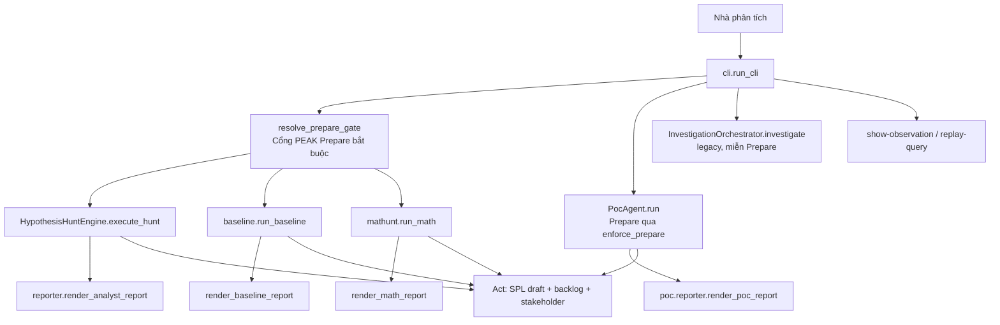
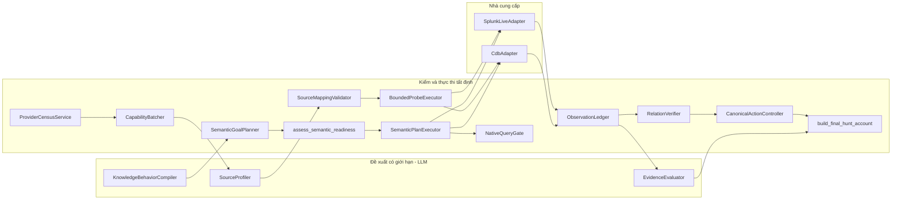
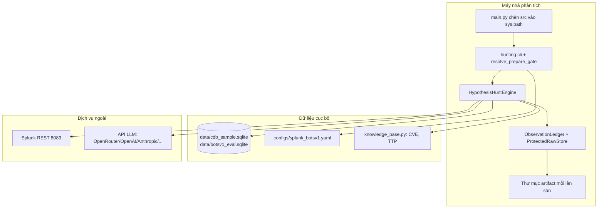

# Chương 4 — Kiến trúc hệ thống và mô hình nhận thức

> Chương này trình bày mô hình nhận thức năm tầng (nền cho mọi ranh giới), ba đường vào của hệ thống, các khối của đường săn chuẩn, sơ đồ triển khai, và các hợp đồng dữ liệu cốt lõi.

## 4.1. Mô hình nhận thức: năm tầng sự thật

Nguyên tắc trung tâm của kiến trúc: hệ thống phân biệt **năm tầng sự thật**, và trộn chúng là lỗi thiết kế chứ không chỉ lỗi diễn đạt.

| Tầng | Vật mang (kiểu dữ liệu) | Ai được tạo | Mức độ được tin |
|---|---|---|---|
| 1. Yêu cầu | `HuntRequest`, `Alert` | Người dùng | Là mục tiêu, chưa phải bằng chứng |
| 2. Đề xuất | `SemanticGoalGraph`, `SourceCapabilityProposal` | Mô hình ngôn ngữ, trong schema | Không tin, cho đến khi bộ kiểm tất định nhận |
| 3. Năng lực | `CapabilityGraph`, `RuntimeCapability` | Census + probe thành công | Tin ở mức "nguồn này quan sát được vai trò này", không phải "sự cố đã xảy ra" |
| 4. Quan sát | `Observation` (trong `ObservationLedger`) | Adapter, qua sổ append-only | Tin ở mức bản ghi gốc đã lưu |
| 5. Kết luận | cạnh `VERIFIED`, `FinalHuntAccount`, `Disposition` | Verifier + controller | Tin trong phạm vi trích dẫn và độ hoàn tất đã ghi |

Luật bất biến: **chỉ bộ kiểm tất định (tầng 5) mới nâng một cạnh từ tầng 2 lên "đã chứng minh".** Mô hình ngôn ngữ dừng ở tầng 2.

### 4.1.1. Ba trạng thái độc lập của một tuyến ngữ nghĩa

`contracts/semantic_route.py` tách ba câu hỏi mà một truy vấn rỗng hay bị gộp làm một:

1. **Thực thi xong** — một lần gọi nhà cung cấp có giới hạn đã kết thúc (`QueryResult.complete` là cờ của lần đó). Số dòng bằng không **không** suy ra hết dữ liệu của mọi tuyến.
2. **Chứng minh xong** — các quan sát được trích dẫn thỏa quan hệ và mọi ràng buộc mà thao tác khai báo là chứng minh được.
3. **Tuyến đã cạn** — mọi giai đoạn truy hồi, mọi trang tiếp, mọi phương án thay đã khai báo đều đã được thử hoặc bị từ chối có lý do kiểm toán.

Đây là nền để chặn lỗi **L3**: một truy vấn rỗng và hoàn tất chỉ chứng tỏ "thực thi xong", chưa chứng minh "sự vắng mặt".

### 4.1.2. Âm tính hợp lệ

`license_valid_negative` (`m5_adapter/controls.py`) chỉ cấp phép một kết quả âm tính khi đồng thời: truy vấn đích chạy được, hoàn tất, không có hàng; **và** ba control đạt — sức khỏe phạm vi, có-bản-ghi-trong-phạm-vi, khả-năng-quan-sát-vị-từ. Thiếu một điều kiện, kết quả ở lại `INCONCLUSIVE`. `HuntOutcome.NO_EVIDENCE_FOUND` và `Disposition` lành tính là hai nhãn khác nhau; báo cáo bị cấm vẽ một truy vấn dở dang thành `BENIGN`.

### 4.1.3. Vai trò trường và lời chứng

`FieldRole` (`contracts/case_graph.py`) khóa các cặp hay bị lẫn: `client_ip` ≠ `server_ip`, `endpoint_host` ≠ `server_host` ≠ `sensor_host`, `account_name` ≠ `person_name`, `domain_name` ≠ IP chưa phân giải. `RelationVerifier` từ chối dùng một hàng tự khai vai trò máy chủ để chứng minh ràng buộc máy trạm người dùng — tên máy chứa `srv` không phải bằng chứng vai trò. Lời chứng của người (`EpistemicType.TESTIMONY`) không bao giờ được nâng thành `OBSERVED`.

## 4.2. Ba đường vào, phân nhánh theo tham số

Dòng lệnh `hunting.cli.run_cli` phân nhánh theo **tham số**, không theo từ khóa trong câu hỏi (chặn lỗi **L2**).

- **Đường săn giả thuyết** (`HypothesisHuntEngine`) là đường kiến trúc v7.
- **Đường cảnh báo** (`InvestigationOrchestrator`, các gói M1–M5) là vòng đời cũ, đầu vào là `Alert`.
- **PoC, baseline, math** là chế độ tất định phục vụ đánh giá và thực hành PEAK.

## 4.3. Các khối của đường săn chuẩn

Bảng trách nhiệm và ranh giới mô hình:

| Khối | Việc | Ranh giới mô hình |
|---|---|---|
| `ProviderCensusService` | Khám phá phân vùng, schema, quyền, độ hoàn tất | Không gọi mô hình |
| `CapabilityBatcher` | Xếp mọi nguồn/trường của một quan hệ vào lô vừa ngữ cảnh | Không gọi mô hình. Điểm số chỉ là thứ tự, không loại nguồn |
| `KnowledgeBehaviorCompiler` | CVE/TTP/IOC tất định, hoặc một đề xuất đồ thị cho câu tự do | Một đề xuất đúng schema. Cấm SPL, cấm kết luận |
| `SourceProfiler` | Đề xuất nguồn, vai trò trường bằng ID census | Một lần mỗi lô. Cấm bịa ID |
| `BoundedProbeExecutor` | Gọi probe của adapter | Tất định. Probe là năng lực quan sát, chưa phải bằng chứng sự cố |
| `SemanticGoalPlanner` | Ghép AND phụ thuộc và OR phương án từ hợp đồng kiểu | Tất định. Không đọc tên thao tác như một kịch bản |
| `NativeQueryGate` | Nhận/từ chối một SPL ứng viên | Tất định. Ngữ pháp là tập con SPL |
| `ObservationLedger` | Ghi quan sát, kết quả truy vấn, ô phủ | Tất định, chỉ thêm (append-only) |
| `RelationVerifier` | Cửa nhận trích dẫn; kiểm hợp đồng/chuyển trạng thái/cặp kiểu | Tất định |
| `CanonicalActionController` | Một mình đổi `HuntState` và quyết định dừng | Tất định |

## 4.4. Sơ đồ triển khai

Secrets của API và mật khẩu Splunk nằm trong môi trường hoặc `.env`, nạp bởi `ApiLLMConfig.from_env`; chúng không được ghi vào state hay manifest phát lại.

## 4.5. Các hợp đồng dữ liệu cốt lõi

Các hợp đồng nằm trong `src/hunting/contracts`, chủ yếu là dataclass và enum, được kiểm bởi constructor và các hàm `parse_and_validate_*`.

- **`HuntRequest`** (`contracts/hunt.py`): `id`, `kind` (`QUESTION`, `HYPOTHESIS`, `TTP`, `IOC`, `CVE`, `CTI_REPORT`, `SCHEDULED`, `NL_QUESTION`), `content`, `entities`, `time_policy`. Thực thể hạt giống là *chưa kiểm* cho đến khi một quan sát thiết lập quan hệ.
- **`SemanticGoalGraph`** (`contracts/semantic_graph.py`): `SemanticVariable` (giá trị có kiểu, không phải trường nhà cung cấp), `SemanticConstraint`, `SemanticRelationGoal`, `SemanticAnswerGoal`, `ProofMethod` (nhiều method là OR; phụ thuộc của một method là AND). `parse_and_validate_semantic_goal_graph` từ chối trôi schema.
- **`CapabilityGraph`** (`contracts/capabilities.py`): ghi nhà cung cấp được chọn, nhà cung cấp bị từ chối và lý do. Một nhà cung cấp tới được nhưng không thỏa claim bị *từ chối*, không dùng làm phương án dự phòng im lặng.
- **`Observation`** (`contracts/observations.py`): giữ kiểu gốc, trường gốc, `Provenance`, `EpistemicType` (`OBSERVED`/`TESTIMONY`), nhãn taint, ô, truy vấn. Sự kiện lạ (`is_unmapped`) vẫn là quan sát hợp lệ, không bị vứt.
- **`StoppingDecision`** và **`HuntOutcome`** (`contracts/hunt.py`): các quyết định dừng tất định (`STOP_RESOLVED`, `STOP_REFUTED`, `STOP_INCONCLUSIVE_*`, `STOP_NEEDS_USER_DECISION`, `STOP_EXHAUSTED_BY_BUDGET`, `STOP_UNSUPPORTED_CAPABILITY`, `STOP_UNREACHABLE`, …) và nhãn nhận thức của giả thuyết (`SUPPORTED`, `CONTRADICTED`, `INCONCLUSIVE`, `NO_EVIDENCE_FOUND`, …).

> Danh mục đầy đủ 260 lớp và 658 hàm/phương thức, kèm khoảng dòng và docstring, nằm ở Phụ lục A của bản một-tệp (`docs/PAPER-BAO-CAO-HE-THONG.md`).
