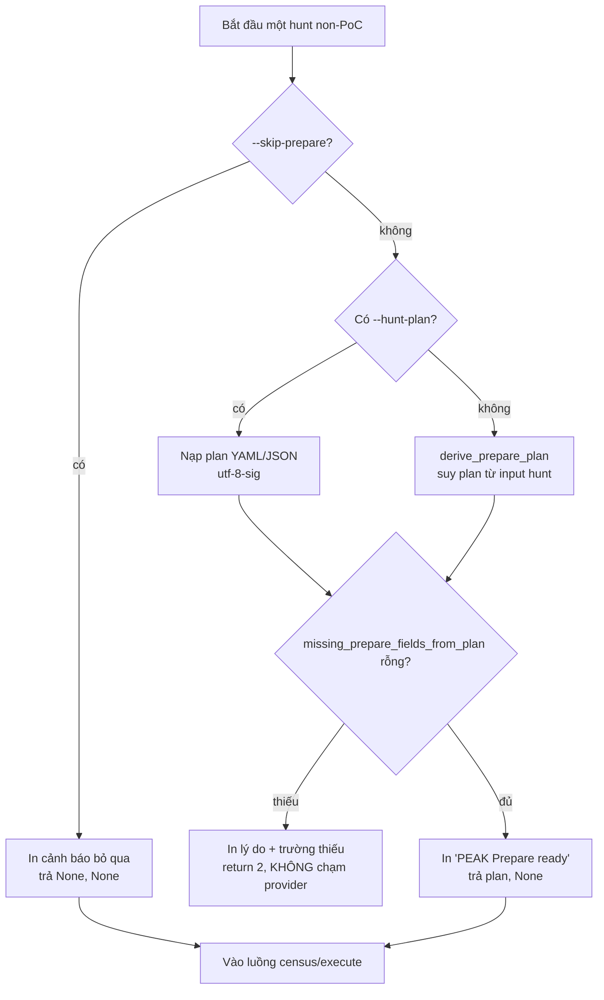

# Chương 5 — Cổng PEAK Prepare bắt buộc (đóng góp kỹ thuật mới nhất)

> Chương này đặc tả đóng góp mới nhất của phiên bản: biến bước Prepare của PEAK từ một ràng buộc chỉ áp cho đường PoC thành một cổng bắt buộc trên mọi đường săn. Chương trình bày động cơ, thiết kế, thuật toán resolve, hiện thực trong mã, và kiểm chứng thực nghiệm ba hành vi.

## 5.1. Động cơ

Trong PEAK, không có cuộc săn nào được bắt đầu mà thiếu bước Prepare — nhà phân tích phải xác định đề tài, mô hình ABLE, phạm vi, thời hạn tối đa và kế hoạch trước khi chạm dữ liệu. Trước phiên bản này, hệ thống chỉ ép Prepare trên **đường PoC** (qua `missing_prepare_fields()` và ngoại lệ `PrepareError` trong `poc/agent.py`). Ba đường săn còn lại chạy thẳng, không qua Prepare:

- Đường giả thuyết (`--hypothesis`, `--cve`, `--ttp`, `--ioc`, `--query`, `--threat-actor`, `--campaign`);
- Đường baseline (`--baseline`);
- Đường M-ATH (`--math`).

Điều này mâu thuẫn với nguyên tắc PEAK "không có hunt nào không có Prepare", và làm cho tuyên bố "hệ thống bám PEAK" chỉ đúng một phần.

## 5.2. Nguyên tắc thiết kế

Yêu cầu đặt ra khi thiết kế cổng:

1. **Bắt buộc trên mọi đường săn** (trừ đường cảnh báo legacy — vốn là triage một alert đã có, không có giả thuyết để chuẩn bị).
2. **Không phá luồng chạy hợp lệ.** Một hunt bình thường (ví dụ `--ttp T1190 --time-window ...`) đã mang đủ thông tin để hình thành một Prepare plan tối thiểu; không nên bắt người dùng viết một tệp plan riêng cho mọi lệnh.
3. **Chạy trước khi chạm nhà cung cấp.** Một hunt không hợp lệ về Prepare phải bị chặn *trước* bước environment audit / provider setup, để không phát sinh kết nối telemetry vô ích.
4. **Có van thoát tường minh** cho test/CI và cho các lần chạy ad-hoc có chủ đích.
5. **Minh bạch và audit được.** Plan đã dùng (dù suy tự động) phải được in ra.

## 5.3. Kiến trúc giải pháp

Ba thành phần được thêm/sửa:

### 5.3.1. `peak.py` — hai hàm mới và một sửa nhỏ

- **`derive_prepare_plan(...)`** — suy một Prepare plan tối thiểu-nhưng-đầy-đủ từ input của hunt. Mọi trường thiếu được điền bằng một giá trị mặc định *tường minh* để plan đầy đủ và nhà phân tích thấy rõ điều gì đã được giả định. `max_duration` được suy từ span của cửa sổ thời gian (nếu có), mặc định `14d`. Nếu `content` (mục tiêu) rỗng, plan cố ý để trống các trường then chốt để cổng chặn — "một hunt không có mục tiêu không phải là một PEAK hunt".
- **`missing_prepare_fields_from_plan(plan)`** — kiểm checklist PEAK trên một dict plan (đường non-PoC không có object PoC), dùng chung danh sách trường bắt buộc `_REQUIRED` (topic, ABLE behavior/location/evidence, scope, max_duration, plan) cộng `research_refs`. Actor được phép trống — PEAK cho phép actor không rõ.
- **`load_hunt_plan`** được sửa đọc `utf-8-sig` để chịu được BOM (trình soạn thảo và PowerShell hay thêm BOM), tránh lỗi decode khi nạp `--hunt-plan`.

### 5.3.2. `cli.py` — hàm resolve dùng chung và cờ van thoát

- **`resolve_prepare_gate(args, hunt_kind, content, ...)`** — hàm dùng chung, gọi ở đầu ba dispatch (baseline, math, hypothesis). Trả về `(plan, error_code)`: thành công `(plan, None)`, bị chặn `(None, 2)`, van thoát `(None, None)`.
- **`--skip-prepare`** — cờ mới (mặc định tắt), bỏ qua cổng cho test/CI hoặc lần chạy ad-hoc có chủ đích; khi bật, hunt chạy mà không ghi plan.

## 5.4. Thuật toán resolve của cổng

Thứ tự ưu tiên (điều kiện đầu tiên khớp thì thắng):

1. `--skip-prepare` bật → in cảnh báo bỏ qua, trả `(None, None)`, hunt chạy tiếp không ghi plan.
2. Có `--hunt-plan` → nạp plan tường minh. Một plan tường minh **thiếu trường** là lỗi cứng → `(None, 2)`: nhà phân tích đã yêu cầu một plan, và nó phải là một PEAK plan hợp lệ.
3. Không có plan → **suy** một plan tối thiểu từ input hunt. Nếu plan suy ra vẫn thiếu (ví dụ không có mục tiêu) → `(None, 2)`.

Thành công thì in `[+] [PREPARE] PEAK Prepare ready: ...` rồi trả `(plan, None)`.



Điểm then chốt: cổng được đặt **trước** environment audit trong `run_cli`, nên một hunt bị chặn không hề gửi yêu cầu tới Splunk hay mở SQLite.

## 5.5. Trích đoạn hiện thực (rút gọn)

Lõi của hàm suy plan (`peak.py`), cho thấy cách `max_duration` suy từ cửa sổ và cách trường thiếu được điền tường minh:

```python
def derive_prepare_plan(*, hunt_kind, content, scope="", time_window="",
                        evidence_hint="", location_hint="", ...):
    kind = str(hunt_kind or "hunt").strip() or "hunt"
    goal = str(content or "").strip()
    topic = goal if goal else ""
    behavior = goal if goal else ""
    location = str(location_hint or "").strip() or (
        f"telemetry in scope {scope}" if scope.strip() else "in-scope telemetry")
    ...
    # PEAK max duration vừa là thời hạn hunt. Suy từ span cửa sổ nếu có.
    if win and "/" in win:
        start, end = validate_time_window_format(win)
        days = max(1, (end - start).days or 1)
        max_duration = f"{days}d"
    ...
    # content rỗng -> topic/behavior/evidence/plan để trống -> cổng chặn
```

Hàm resolve (`cli.py`), cho thấy ba nhánh và điểm chặn trả 2:

```python
def resolve_prepare_gate(args, *, hunt_kind, content, ...):
    if getattr(args, "skip_prepare", False):
        print("[!] [PREPARE] PEAK Prepare gate skipped (--skip-prepare); no plan recorded.")
        return None, None
    if plan_path:                      # --hunt-plan tường minh
        plan = load_hunt_plan(plan_path); explicit = True
    else:                              # suy tự động
        plan = derive_prepare_plan(hunt_kind=hunt_kind, content=content, ...)
    missing = missing_prepare_fields_from_plan(plan)
    if missing:
        print(f"[-] [PREPARE] PEAK Prepare is incomplete ... (missing: {', '.join(missing)}) ...")
        return None, 2
    print(f"[+] [PREPARE] PEAK Prepare ready: topic={plan.get('topic')!r} ...")
    return plan, None
```

Cổng được nối vào ba dispatch bằng ba lời gọi tương tự, ví dụ ở baseline:

```python
_plan, _gate = resolve_prepare_gate(args, hunt_kind="baseline",
    content=f"baseline survey (EDA) of {data_source}", scope=..., time_window=window, ...)
if _gate is not None:
    return _gate
```

Ở đường giả thuyết, cổng đặt ngay sau khi xác định `is_hypothesis_hunt` và trước environment audit; đường cảnh báo legacy được miễn.

## 5.6. Kiểm chứng ba hành vi (đo trong phiên báo cáo)

| # | Kịch bản | Lệnh | Kết quả đo |
|---|---|---|---|
| 1 | Hunt bình thường (plan suy tự động) | `--hypothesis "Amber Turing visited a competitor website..." --provider cdb` | In `[+] [PREPARE] PEAK Prepare ready: topic='Amber Turing visited...' scope='hypothesis over the selected telemetry' max_duration='14d' (source=derived from hunt inputs)`, hunt chạy tiếp bình thường (INCONCLUSIVE) |
| 2 | `--hunt-plan` thiếu trường | `--baseline cdb:events --hunt-plan bad.json` (plan chỉ có `topic`) | **Exit 2**, báo `missing: able.behavior, able.location, able.evidence, scope, max_duration, plan, research_refs` |
| 3 | Van thoát | `--baseline cdb:events --skip-prepare` | **Exit 0**, in `[!] [PREPARE] PEAK Prepare gate skipped`, baseline chạy bình thường |

Ngoài ra, kiểm chứng phát hiện một lỗi phụ đã được sửa cùng đóng góp này: `load_hunt_plan` trước đó đọc `utf-8`, gặp BOM do PowerShell/editor thêm vào thì báo `Unexpected UTF-8 BOM`; sửa thành `utf-8-sig` khắc phục.

## 5.7. Không phá luồng cũ

Sau thay đổi, toàn bộ **514 test đạt / 13 bỏ qua / 0 thất bại** (chạy lại hai lần trong phiên báo cáo). Thiết kế đảm bảo điều này bằng ba cơ chế:

1. Các test unit của baseline/math gọi thẳng `run_baseline`/`run_math` (không qua CLI), nên không chạm cổng.
2. Các test CLI đường giả thuyết (`--cve`, `--ttp`, `--query`) không truyền `--hunt-plan`, nhưng cổng **suy tự động** một plan đầy đủ từ chính các cờ đó, nên vẫn chạy tiếp (exit 0) như trước.
3. `--skip-prepare` là van thoát cho bất kỳ test nào cần bỏ qua tường minh.

## 5.8. Vị trí trong tài liệu và mã

- Đặc tả chi tiết: `docs/PEAK-PREPARE-GATE.md`.
- Mã: `src/hunting/peak.py` (`derive_prepare_plan`, `missing_prepare_fields_from_plan`, `load_hunt_plan` sửa BOM), `src/hunting/cli.py` (`resolve_prepare_gate`, cờ `--skip-prepare`, ba lời gọi ở baseline/math/hypothesis).
