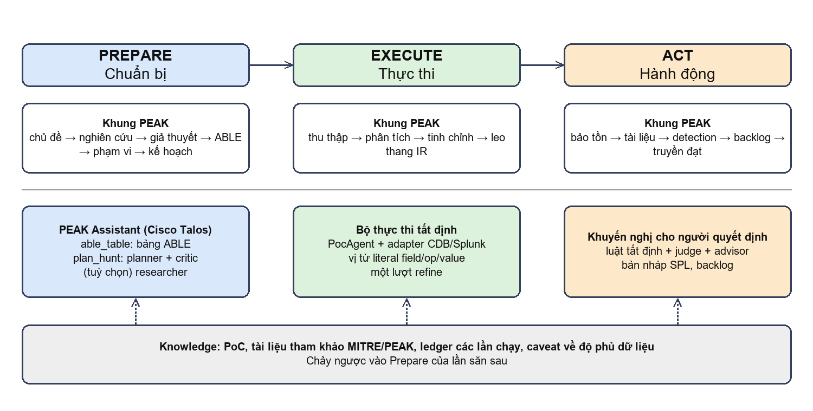

# Chương 2. Cơ sở lý thuyết

Chương này trình bày các khái niệm nền tảng mà hệ thống dựa vào. Mỗi mục kết thúc bằng phần "áp dụng vào đồ án" để người đọc thấy khái niệm đó ảnh hưởng thế nào tới thiết kế ở các chương sau.

## 2.1. Săn mối đe dọa

### 2.1.1. Định nghĩa và vị trí trong vận hành an ninh

Săn mối đe dọa là hoạt động chủ động, do con người dẫn dắt và có máy hỗ trợ, nhằm tìm ra những hoạt động độc hại đã lọt qua các lớp phát hiện tự động. Điểm xuất phát là giả định đã bị xâm nhập (assume breach): người săn không đợi cảnh báo mà đặt câu hỏi "nếu kẻ tấn công đã ở trong mạng thì dấu vết của chúng trông như thế nào, và dữ liệu nào có thể chứa dấu vết đó". Kết quả của một cuộc săn vì thế không chỉ là nhị phân "có/không tấn công". Nó có thể là: giả thuyết được xác nhận, giả thuyết bị bác bỏ trong phạm vi dữ liệu đã xem, hoặc không kết luận được do dữ liệu không đủ. Một cuộc săn dù không tìm thấy kẻ tấn công vẫn tạo giá trị: phát hiện khoảng trống dữ liệu, sinh ra luật phát hiện mới, hoặc củng cố hiểu biết về môi trường [1].

Trong chu trình xử lý sự cố của NIST [16], săn mối đe dọa nằm ở phần phát hiện và phân tích, và khi tìm thấy dấu hiệu thật thì chuyển giao cho nhóm ứng cứu sự cố (IR). Điều này giải thích vì sao đầu ra cuối cùng của hệ thống trong đồ án là một khuyến nghị về việc có chuyển giao cho IR hay không, chứ không phải một bản án.

### 2.1.2. Mô hình trưởng thành của hoạt động săn

Bianco đề xuất Hunting Maturity Model gồm năm mức từ HMM0 đến HMM4: ban đầu (chỉ dựa vào cảnh báo tự động), tối thiểu (có tra cứu chỉ báo), theo quy trình (dùng quy trình do người khác viết), đổi mới (tự tạo quy trình mới) và dẫn đầu (tự động hoá quy trình hiệu quả thành phát hiện) [8]. Mô hình cho thấy một hướng phát triển tự nhiên: các cuộc săn thủ công thành công nên được chuyển thành luật phát hiện tự động. Trong khung PEAK, bước đó gắn với pha Act.

### 2.1.3. Kim tự tháp đau đớn và hành vi

Kim tự tháp đau đớn (Pyramid of Pain) xếp các loại chỉ báo theo mức khó khăn mà kẻ tấn công phải chịu khi bị buộc đổi chúng: giá trị băm, địa chỉ IP, tên miền, dấu vết mạng và máy, công cụ, và cuối cùng là chiến thuật, kỹ thuật, quy trình (TTP) [7]. Săn theo hành vi nằm ở đỉnh tháp vì kẻ tấn công khó đổi hành vi hơn là đổi một địa chỉ IP. Đồ án thể hiện điều này trong các PoC: PoC khai thác Joomla và PoC mã hoá PowerShell là chỉ báo hành vi, còn PoC beacon tới `ad.networkfilter.co` là chỉ báo ở mức tên miền, vốn dễ bị thay đổi.

## 2.2. Khung PEAK

### 2.2.1. Ba pha và yếu tố tri thức

PEAK do nhóm Splunk SURGe (trong đó có David Bianco, người sau này cũng là tác giả chính của PEAK Assistant) giới thiệu năm 2023 [1]. Tên gọi là chữ viết tắt của ba pha cộng một yếu tố xuyên suốt:

- **Prepare:** chọn chủ đề, nghiên cứu, phát biểu giả thuyết, xác định phạm vi và dữ liệu cần dùng, lập kế hoạch.
- **Execute:** thu thập dữ liệu, xử lý sơ bộ, phân tích, tinh chỉnh giả thuyết, và leo thang khi có phát hiện nghiêm trọng.
- **Act:** bảo tồn kết quả, ghi tài liệu, tạo luật phát hiện, đưa việc còn lại vào backlog và truyền đạt cho các bên liên quan.
- **Knowledge:** threat intelligence, ngữ cảnh của tổ chức, kinh nghiệm người săn và chính kết quả các cuộc săn trước, chảy vào cả ba pha.

PEAK là quy trình dành cho nhà phân tích con người chứ không phải đặc tả phần mềm. Vì vậy, hệ thống trong đồ án không tự nhận là "hiện thực PEAK được chứng nhận". Nó chỉ hiện thực hoá ba pha theo hướng hỗ trợ: PEAK Assistant làm Prepare, bộ thực thi tất định làm Execute, và mô-đun khuyến nghị làm Act.

### 2.2.2. Ba loại săn của PEAK

PEAK định nghĩa ba loại săn, cùng đi qua ba pha trên [2][3][4].

Bảng: Ba loại săn trong PEAK và phạm vi của đồ án
| Loại | Mục đích | Cách làm | Trong đồ án |
|---|---|---|---|
| Hypothesis-driven | Kiểm chứng một giả thuyết về hành vi kẻ tấn công | Chọn chủ đề, làm cho kiểm chứng được, tinh chỉnh cho đủ cụ thể, rồi truy vấn dữ liệu | **Có** (đối tượng chính) |
| Baseline | Mô tả "bình thường" để nhìn ra độ lệch | Từ điển dữ liệu, phân bố, ngoại lệ, khoảng trống; khuyến nghị cửa sổ 30–90 ngày | Không (ngoài phạm vi) |
| M-ATH (Model-Assisted) | Dùng thuật toán tìm đầu mối khi cách đơn giản không đủ | Phân loại, phân cụm, phát hiện bất thường, có người trong vòng lặp | Không (ngoài phạm vi) |

### 2.2.3. Mô hình ABLE

ABLE là cách PEAK biến một giả thuyết thành kế hoạch hành động. Mỗi chữ cái là một câu hỏi người săn phải trả lời:

Bảng: Bốn thành phần của ABLE
| Thành phần | Câu hỏi | Ví dụ (rò rỉ dữ liệu qua DNS) |
|---|---|---|
| Actor | Ai thực hiện (được phép để trống) | Chưa rõ nhóm cụ thể |
| Behavior | Hành vi cụ thể, nên chỉ 1–2 kỹ thuật | DNS tunneling |
| Location | Hành vi xảy ra ở phần nào của mạng | Máy trạm phòng tài chính và biên mạng |
| Evidence | Cần nguồn dữ liệu nào, và dấu hiệu trúng trông ra sao | Nhật ký DNS: truy vấn dài, loại bản ghi lạ |

ABLE đóng vai trò cầu nối giữa phát biểu giả thuyết bằng văn xuôi và truy vấn cụ thể. PEAK Assistant có một tác tử riêng sinh bảng ABLE từ giả thuyết, tài liệu nghiên cứu và mô tả dữ liệu cục bộ [5]. Trong đồ án, bảng ABLE do PEAK sinh ra là thông tin tham khảo cho người săn, còn các vị từ thực thi do PoC khai báo.

## 2.3. MITRE ATT&CK và chỉ báo thực thi

MITRE ATT&CK là cơ sở tri thức về chiến thuật và kỹ thuật của kẻ tấn công dựa trên quan sát thực tế [6]. Mỗi kỹ thuật có mã định danh, ví dụ T1190 (khai thác ứng dụng hướng ra Internet), T1110 (dò mật khẩu), T1059.001 (PowerShell), T1071.001 (giao thức tầng ứng dụng: web). Mã này giúp người săn tìm tài liệu nghiên cứu và đặt tên kết quả theo ngôn ngữ chung. Trong các PoC của đồ án, mỗi PoC gắn một kỹ thuật ATT&CK trong trường `references` và `able.behavior`.

## 2.4. Mô hình ngôn ngữ lớn và hệ thống đa tác tử

### 2.4.1. LLM như một thành phần tạo văn bản

LLM sinh văn bản bằng cách dự đoán chuỗi token tiếp theo. Chúng mạnh ở các việc như tóm tắt tài liệu, diễn đạt lại, chuyển tài liệu thành cấu trúc, và gợi ý bước tiếp theo. Chúng yếu ở những việc đòi hỏi tính đúng đắn tuyệt đối trên dữ liệu cụ thể, vì không có cơ chế nội tại để đối chiếu mỗi câu với nguồn. Hiện tượng sinh ra thông tin nghe hợp lý nhưng sai hoặc không có căn cứ được gọi là ảo giác (hallucination) [12]. Truy hồi tăng cường (retrieval-augmented generation) giảm rủi ro này bằng cách đưa tài liệu nguồn vào ngữ cảnh [14]; tuy nhiên nó không loại bỏ hoàn toàn, vì mô hình vẫn có thể diễn giải sai tài liệu được cung cấp.

### 2.4.2. Tác tử và đa tác tử

Một tác tử LLM là một vòng lặp trong đó mô hình quyết định hành động tiếp theo, quan sát kết quả và tiếp tục; ReAct là một mô hình điển hình kết hợp suy luận và hành động [10]. Hệ thống đa tác tử cho nhiều tác tử với vai trò khác nhau trao đổi với nhau. AutoGen là một khung phổ biến cho kiểu này, hỗ trợ các nhóm tác tử trò chuyện theo lượt và điều kiện dừng [9]. PEAK Assistant dùng AutoGen: nhóm lập kế hoạch có một tác tử viết kế hoạch và một tác tử phê bình, luân phiên cho tới khi tác tử phê bình trả về tín hiệu kết thúc [5]. Mô hình "người viết và người phản biện" này thường cải thiện chất lượng văn bản, nhưng cũng làm số lượt gọi LLM không cố định trước, và khó kiểm soát chi phí.

### 2.4.3. LLM làm giám khảo

Dùng LLM để chấm hoặc đánh giá đầu ra (LLM-as-a-judge) được nghiên cứu rộng rãi và cho thấy mức đồng thuận với người đánh giá khá cao trên một số tác vụ, nhưng cũng có thiên lệch và không ổn định giữa các lần chạy [11]. Vì vậy trong đồ án, "judge" chỉ được dùng như ý kiến tham khảo thứ hai: nó nhận hàng bằng chứng đã được bộ thực thi lấy ra và trả lời một trong bốn nhãn (TRUE_POSITIVE, FALSE_POSITIVE, INCONCLUSIVE, NO_SIGNAL) kèm độ tin cậy. Luật khuyến nghị tất định luôn là bên quyết định, và judge chỉ có thể đẩy kết quả đi tối đa một bậc.

## 2.5. Độ tin cậy của bằng chứng và bằng chứng âm tính

### 2.5.1. Vắng bằng chứng không phải bằng chứng vắng mặt

Altman và Bland nhấn mạnh rằng một nghiên cứu không tìm thấy hiệu ứng chưa chứng minh hiệu ứng không tồn tại [13]. Trong săn mối đe dọa, điều tương đương là một truy vấn rỗng. Có ít nhất bốn nguyên nhân khiến truy vấn rỗng mà vẫn có tấn công: nguồn dữ liệu không được thu thập; nguồn có nhưng không chứa loại sự kiện cần tìm; cửa sổ thời gian không bao trùm hoạt động; và vị từ literal bỏ sót biến thể. Hệ thống trong đồ án không xử lý hết được cả bốn, nhưng hiện thực hoá hai (độ phủ nguồn trong cửa sổ; giới hạn cửa sổ) và nêu rõ hai còn lại trong phần "giới hạn của kết luận" của mỗi báo cáo.

### 2.5.2. Tách bạch bằng chứng và diễn giải

Nguyên tắc thiết kế chung của đồ án là hai lớp. Lớp bằng chứng chỉ gồm các bản ghi do adapter trả về từ telemetry, có thể tái lập. Lớp diễn giải gồm mọi văn bản do LLM sinh ra (ABLE, kế hoạch, judge, advisor), luôn được gắn nhãn là tham khảo. Bản ghi không bao giờ đi từ lớp diễn giải sang lớp bằng chứng. Nguyên tắc này đối ứng với khuyến nghị của OWASP về ứng dụng dùng LLM: không tin tưởng đầu ra của mô hình như dữ liệu đã xác thực và không giao cho mô hình quyền thực thi không kiểm soát [17].

## 2.6. Hỗ trợ ra quyết định

Hệ thống hỗ trợ ra quyết định khác hệ thống ra quyết định tự động ở chỗ nó đưa phương án, lý do và rủi ro, còn quyền chọn thuộc về người dùng. Một khuyến nghị tốt cho người săn cần: nêu rõ kết luận và mức độ tin cậy; liệt kê các lựa chọn theo thứ tự ưu tiên; chỉ ra bằng chứng nào ủng hộ và điều gì còn chưa biết; nêu hậu quả của việc chọn sai. Đồ án chuyển các yêu cầu này thành cấu trúc dữ liệu `Recommendation` với các trường `disposition`, `confidence`, `reasons`, `caveats`, `options`, `next_steps`, `questions_for_hunter`, `risks` và cờ `decision_required` luôn bằng đúng.

## 2.7. Telemetry và bộ dữ liệu Boss of the SOC v1

Telemetry là dữ liệu quan sát được từ hệ thống: tạo tiến trình (sự kiện 4688 của Windows hoặc sự kiện 1 của Sysmon), xác thực (4624 đăng nhập thành công, 4625 đăng nhập thất bại), truy cập chia sẻ SMB (5140, 5145), truy vấn DNS và yêu cầu web. Mỗi nguồn trả lời được một lớp câu hỏi, và không nguồn nào trả lời được tất cả. Ví dụ, yêu cầu web chứa trong dữ liệu của đồ án chỉ có tên miền và đường dẫn, không có mã trạng thái, nên không đủ để chứng minh một cuộc khai thác thành công.

Boss of the SOC (BOTS) v1 là bộ dữ liệu do Splunk công bố cho các cuộc thi và huấn luyện an ninh, chứa nhật ký từ một môi trường mô phỏng bị tấn công trong tháng 8 năm 2016, bao gồm cả giai đoạn quét và khai thác một máy chủ Joomla [15]. Trong đồ án, dữ liệu được nạp vào một bảng SQLite `events` gồm 4.417.543 dòng trải trên 28 ngày.

## 2.8. Tổng hợp: từ lý thuyết đến quyết định thiết kế

Bảng: Từ cơ sở lý thuyết đến quyết định thiết kế
| Cơ sở lý thuyết | Hệ quả thiết kế |
|---|---|
| PEAK có ba pha, Prepare tốn công và hợp với LLM | PEAK Assistant đảm nhiệm Prepare; Execute và Act tách riêng |
| ABLE nối giả thuyết với truy vấn | Bảng ABLE do PEAK sinh là đầu vào cho kế hoạch và cho advisor |
| LLM có thể ảo giác [12] | LLM không bao giờ tạo hoặc sửa bản ghi bằng chứng |
| LLM-as-judge không ổn định [11] | Judge chỉ tham khảo, chỉ đẩy khuyến nghị tối đa một bậc |
| Vắng bằng chứng không phải bằng chứng vắng [13] | Kiểm tra độ phủ nguồn; rỗng + thiếu nguồn thành `COLLECT_DATA_THEN_RERUN` |
| Khuyến nghị cần lý do và rủi ro | Cấu trúc `Recommendation` đầy đủ và cờ `decision_required` |
| Đa tác tử khó dự đoán số lượt gọi [9] | Giới hạn thời gian từng bước, gọi lại có backoff, quay về kế hoạch của PoC |
