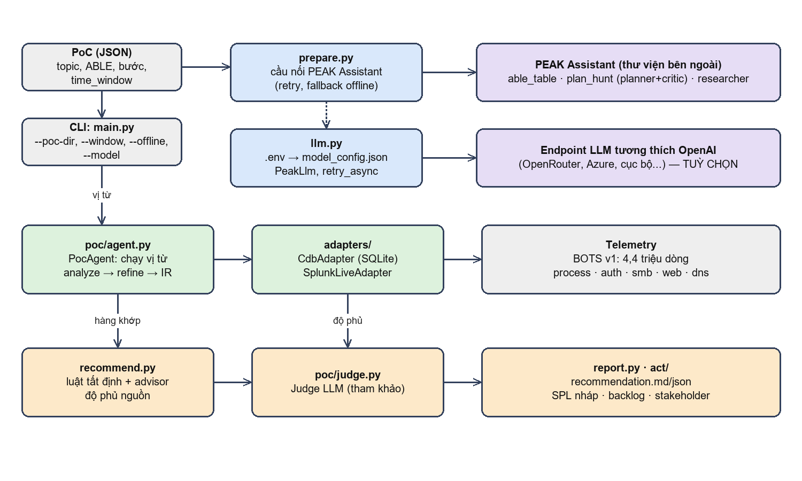
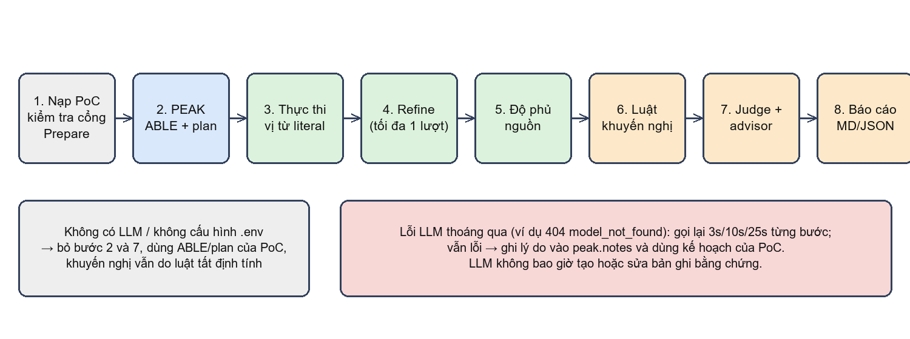
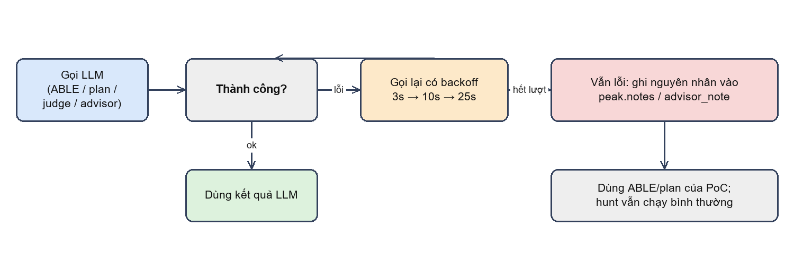
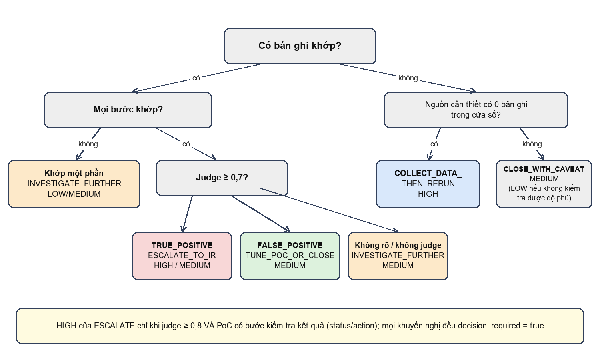

# Chương 4. Thiết kế hệ thống

## 4.1. Tổng quan kiến trúc

Hệ thống gồm ba nhóm thành phần ứng với ba pha PEAK, cộng một lớp hạ tầng LLM dùng chung. Hình 2 trình bày các mô-đun và luồng dữ liệu chính.

- **Nhóm Prepare** (`prepare.py`, `llm.py`): gọi PEAK Assistant để sinh bảng ABLE và kế hoạch săn. Đây là nơi duy nhất mã của hệ thống gọi vào thư viện PEAK Assistant.
- **Nhóm Execute** (`poc/`, `adapters/`): nạp PoC, chạy các vị từ literal qua adapter, tinh chỉnh tối đa một lượt, ghi sổ cái (ledger). Không có LLM trong việc khớp bản ghi.
- **Nhóm Act** (`recommend.py`, `poc/judge.py`, `report.py`, `act/`): tính độ phủ nguồn, sinh khuyến nghị bằng luật tất định, hỏi judge và advisor (tuỳ chọn), xuất báo cáo, bản nháp SPL, backlog và ghi chú cho các bên liên quan.
- **Lớp LLM dùng chung** (`llm.py`): biến cấu hình trong `.env` thành cấu hình mô hình của PEAK, và cung cấp một bộ gọi đồng bộ cho judge và advisor, để mọi lần gọi đều đi qua cùng một đường và cùng một chính sách gọi lại.

## 4.2. Luồng xử lý một PoC

Hình 3 trình bày luồng tám bước khi chạy một PoC. Các bước 2 và 7 là các bước có LLM; khi không có LLM, chúng được bỏ qua và phần còn lại không đổi.

1. **Nạp PoC và kiểm tra cổng Prepare.** PoC phải có chủ đề, hành vi, vị trí, bằng chứng, phạm vi, thời lượng tối đa, kế hoạch và tài liệu nghiên cứu (trường actor được để trống). Thiếu một trường thì PoC bị từ chối trước khi chạm vào telemetry.
2. **PEAK Prepare.** Dựng đầu vào cho PEAK từ PoC và từ mô tả telemetry của adapter, gọi `able_table` rồi `plan_hunt`.
3. **Thực thi vị từ.** Mỗi bước của PoC được thực hiện qua adapter bằng phép tìm văn bản thô (quét tối đa 2.000 hàng), rồi bộ lọc đúng toán tử được áp dụng lên trường đích; tối đa 100 hàng được giữ làm bằng chứng và tổng số hàng khớp được ghi lại. Ngoài vị từ, truy vấn còn chịu phạm vi suy ra từ ABLE **của PoC** (host từ `able.location`, các chuỗi cụ thể từ `able.behavior` và `able.evidence`); phạm vi này được hiển thị trong báo cáo.
4. **Tinh chỉnh.** Tối đa một lượt: nếu mọi hit đến từ đúng một máy thì chạy lại các bước còn lại trên máy đó; nếu rỗng thì chạy lại đúng các vị từ gốc. Toán tử không bao giờ bị nới (EQUALS không thành CONTAINS).
5. **Độ phủ nguồn.** Với mỗi `source_kind` của các bước, đếm số bản ghi của nguồn đó trong cửa sổ và trong phạm vi host của PoC, đồng thời liệt kê các loại sự kiện thực có. Nếu nguồn có dữ liệu nhưng không có bản ghi nào trong phạm vi host, hệ thống chạy lại PoC một lần không lọc host (thư mục `unscoped_probe/`) để phân biệt "host này không ghi nguồn" với "không có hoạt động ở đâu cả".
6. **Luật khuyến nghị.** Tính `disposition` và `confidence` từ bằng chứng, độ phủ và nhận định judge.
7. **Judge và advisor.** Judge chỉ chạy khi có bản ghi khớp. Advisor luôn chạy nếu có LLM, nhận kế hoạch PEAK và tóm tắt bằng chứng, và trả về bước tiếp theo, câu hỏi và rủi ro.
8. **Báo cáo.** Ghi `recommendation.md`, `recommendation.json`, bản nháp SPL và các tệp phụ.

## 4.3. Mô hình dữ liệu

### 4.3.1. PoC

PoC là cấu trúc bất biến gồm hai phần. Phần Prepare: `topic`, `actor`, `behavior`, `location`, `evidence`, `research_refs`, `scope`, `max_duration`, `plan`. Phần thực thi: danh sách `steps` (mỗi bước có `step_id`, `description`, `target_field`, `op`, `value`, `source_kind`), danh sách `fallbacks`, `references` và `expected_chain`. Hệ thống bổ sung `time_window` làm cửa sổ mặc định.

Sáu toán tử được hỗ trợ: `EQUALS`, `CONTAINS`, `STARTS_WITH`, `ENDS_WITH`, `MATCHES` (biểu thức chính quy) và `EXISTS`. Bốn toán tử đầu so sánh không phân biệt hoa thường; `EQUALS` còn khớp theo tên tệp cuối đường dẫn (ví dụ `C:\Windows\...\powershell.exe` khớp `powershell.exe`) nhưng không khớp `splunk-powershell.exe`.

### 4.3.2. Kết quả thực thi và bằng chứng

`PocHuntResult` giữ danh sách `StepResult` (số hàng và các hàng của từng bước), danh sách bước đã khớp, nhận định judge (nếu có), nhật ký tinh chỉnh và đường dẫn sổ cái. `EvidenceSummary` là bản tóm tắt phục vụ khuyến nghị: với mỗi bước có số hàng khớp và số bản ghi nguồn trong cửa sổ; ngoài ra có thời điểm đầu và cuối của hit, các giá trị xoay trục hàng đầu (máy, người dùng, IP, tên miền), giá trị phổ biến của các trường đích và tối đa năm hàng mẫu. `EvidenceSummary` còn mang phạm vi truy vấn thực tế (`scope`), số bản ghi khớp tổng và cờ bị cắt của từng bước, cơ cấu loại sự kiện của nguồn, các host thực sự ghi nguồn khi phạm vi host rỗng, và kết quả chạy lại không lọc host (`unscoped_probe`).

### 4.3.3. Khuyến nghị

`Recommendation` là đầu ra cuối. Các trường chính và ý nghĩa:

Bảng: Các trường của Recommendation
| Trường | Ý nghĩa |
|---|---|
| `disposition` | Một trong năm giá trị: `ESCALATE_TO_IR`, `INVESTIGATE_FURTHER`, `TUNE_POC_OR_CLOSE`, `COLLECT_DATA_THEN_RERUN`, `CLOSE_WITH_CAVEAT` |
| `confidence` | `HIGH`, `MEDIUM` hoặc `LOW` |
| `reasons` | Các lý do tất định dẫn tới kết luận |
| `caveats` | Giới hạn của kết luận (độ phủ, biến thể, cửa sổ, thành công chưa chứng minh) |
| `options` | Các lựa chọn xếp hạng cho người quyết định, mỗi lựa chọn có việc cần làm |
| `judge` | Nhận định tham khảo của LLM (nếu có) |
| `next_steps`, `questions_for_hunter`, `risks` | Phần advisor tạo, tối đa năm mục mỗi loại |
| `decision_required` | Luôn bằng đúng |

## 4.4. Lớp cầu nối PEAK Assistant

PEAK Assistant cung cấp các hàm bất đồng bộ độc lập, nên lớp cầu nối chỉ cần dựng đúng đầu vào, gọi, kiểm tra đầu ra và xử lý lỗi. Đầu vào được dựng như sau:

- **Giả thuyết:** tên PoC ghép với phần tóm tắt.
- **Tài liệu nghiên cứu:** dựng từ chủ đề, tài liệu tham khảo, tham chiếu MITRE, chuỗi quan sát kỳ vọng và các vị từ do nhà phân tích viết. Với tuỳ chọn `--research`, tác tử `researcher` của PEAK được dùng thay thế (cần máy chủ MCP nghiên cứu).
- **Tài liệu dữ liệu cục bộ và khám phá dữ liệu:** mô tả do adapter sinh ra (`describe_data`): tên bảng, các cột, các loại sự kiện, số dòng và khoảng thời gian của từng loại. Trong cài đặt gốc của PEAK, tài liệu này đến từ bước khám phá dữ liệu qua máy chủ MCP của Splunk; đồ án thay bằng mô tả trực tiếp từ adapter.
- **Ngữ cảnh cục bộ:** một đoạn văn bản cố định nói rõ rằng hunt chạy bằng bộ thực thi tất định, mỗi bước là một vị từ literal, các toán tử và quy tắc phân biệt hoa thường, LLM không tạo bằng chứng, và kế hoạch phải nói rõ chỗ nào dữ liệu hiện có không trả lời được. Ngữ cảnh này làm cho kế hoạch do PEAK viết bám vào năng lực thật của hệ thống thay vì giả định một Splunk đầy đủ.

Hình 4 mô tả chính sách lỗi. Mỗi bước (ABLE, kế hoạch) được gọi lại tối đa ba lần với khoảng chờ 3, 10 và 25 giây. Nếu cả cuộc Prepare thất bại, thử lại một lần nữa toàn bộ. Nếu vẫn thất bại, hệ thống dùng bảng ABLE và kế hoạch dựng từ chính PoC, ghi nguyên nhân vào `peak.notes` và đánh dấu `used_peak = false`. Việc săn không bị gián đoạn.

## 4.5. Bộ thực thi và adapter

### 4.5.1. Khớp hai tầng

Adapter CDB thực hiện phép tìm văn bản thô: mỗi giá trị tìm kiếm được so khớp bằng `LIKE` trên các cột văn bản (`raw_ref`, `cmdline`, `image`, `file_path`, `domain`, `user`, `host`, `native_type`) với tham số hoá an toàn. Phép tìm này có chủ ý rộng để không bỏ sót. Sau đó bộ thực thi áp dụng toán tử thật của bước lên đúng trường đích. Thiết kế hai tầng này sinh ra từ một lỗi thực tế: khi chỉ dùng `LIKE`, vị từ `image EQUALS powershell.exe` khớp luôn cả `splunk-powershell.exe` và tạo 100 báo động giả trên 4,38 triệu dòng; bộ lọc chính xác ở tầng hai đưa tỷ lệ này về không.

**Giới hạn hàng và quét.** Nếu adapter chỉ trả 100 hàng rồi mới lọc, các hàng khớp đúng có thể nằm ngoài 100 hàng đầu và bị bỏ sót; một kiểm tra thực tế cho thấy bước `EQUALS` của PoC Joomla chỉ còn 99 hàng vì một hàng trong 100 hàng đầu bị bộ lọc loại, trong khi tổng số khớp thật lớn hơn nhiều. Vì vậy mỗi bước quét tối đa `SCAN_LIMIT = 2000` hàng, áp dụng toán tử, rồi giữ `ROW_CAP = 100` hàng đầu làm bằng chứng và lưu `matched_total`. Cờ `scan_truncated` cho biết lượt quét chạm giới hạn, nghĩa là tổng chỉ là cận dưới (báo cáo ghi `≥`).

**Hai toán tử cần xử lý riêng ở tầng truy xuất.** `MATCHES` không thể đưa nguyên biểu thức chính quy vào `LIKE` (dấu `.` hay `\d` sẽ không khớp gì); hệ thống chỉ dùng đoạn literal bắt buộc dài nhất của biểu thức (ví dụ `acunet` cho `acunet.x-\d+`) để thu hẹp, và bỏ thu hẹp nếu biểu thức có phép chọn `|`. `EXISTS` được đẩy xuống SQL thành điều kiện "trường khác rỗng" để giới hạn hàng không che mất kết quả.

### 4.5.2. Độ phủ nguồn

Mỗi bước khai báo `source_kind` (`process`, `web`, `dns`, `authentication`, `file`, `smb`). Adapter ánh xạ loại nguồn sang các giá trị `native_type` tương ứng và có ba truy vấn có tham số: đếm bản ghi trong cửa sổ (tuỳ chọn theo host), liệt kê loại sự kiện `native_type/event_id` kèm số lượng, và liệt kê các host thực sự ghi nguồn. Nếu adapter không có các phương thức này (như adapter Splunk hiện tại), độ phủ được ghi là "không kiểm tra được", và luật khuyến nghị hạ độ tin cậy tương ứng.

**Phạm vi host ngầm.** Hàm `able_drive` suy ra một host từ `able.location` (token đầu tiên trông giống tên máy, ví dụ `we1149srv`), một tài khoản từ `able.actor` và các literal cụ thể từ `able.behavior`/`able.evidence`; chúng được thêm vào mọi bước. Đây là hành vi có chủ ý của thiết kế Execute từ phiên bản trước nhưng không hiển thị trong predicate, nên đồ án bổ sung ba biện pháp: (i) báo cáo ghi rõ phạm vi thực tế; (ii) độ phủ được đếm cả trong phạm vi host; (iii) khi phạm vi host không có dữ liệu mà cửa sổ có, hệ thống chạy lại không lọc host. Lý do cần cả ba được nêu ở mục 7.2.2: trong dữ liệu thực nghiệm, máy được nêu trong `location` của cả ba PoC rỗng không ghi nguồn tương ứng, nên các PoC này chưa từng thực sự tìm kiếm trên dữ liệu nào.

### 4.5.3. Giới hạn cửa sổ và thời lượng

Trường `max_duration` làm hai việc: cắt cửa sổ telemetry dài hơn thời lượng này về phần cuối, và đặt hạn cho lượt tinh chỉnh. Cửa sổ cụ thể lấy từ `--window` hoặc từ `time_window` của PoC.

## 4.6. Bộ luật khuyến nghị

### 4.6.1. Các disposition

- `ESCALATE_TO_IR`: chuỗi khớp đủ và judge nhận định có dấu hiệu độc hại với độ tin cậy từ 0,7.
- `INVESTIGATE_FURTHER`: có bản ghi khớp nhưng chuỗi chưa đủ, hoặc ngữ cảnh chưa chứng minh.
- `TUNE_POC_OR_CLOSE`: chuỗi khớp đủ nhưng judge thấy hoạt động hợp lệ; nên thêm điều kiện loại trừ hoặc đóng.
- `COLLECT_DATA_THEN_RERUN`: không có hit và có nguồn cần thiết với 0 bản ghi trong cửa sổ (hoặc 0 bản ghi trong phạm vi host mà không có lần chạy lại không lọc host); không có dữ liệu thì không có kết luận.
- `CLOSE_WITH_CAVEAT`: không có hit trong khi nguồn có dữ liệu; có thể đóng nhưng phải ghi rõ giới hạn.

### 4.6.2. Cây quyết định

Bảng: Luật xác định khuyến nghị và độ tin cậy
| Điều kiện | Khuyến nghị | Tin cậy |
|---|---|---|
| Mọi bước khớp, judge TRUE_POSITIVE ≥ 0,7 | `ESCALATE_TO_IR` | HIGH nếu judge ≥ 0,8 và PoC có bước kiểm tra kết quả; ngược lại MEDIUM |
| Mọi bước khớp, judge FALSE_POSITIVE ≥ 0,7 | `TUNE_POC_OR_CLOSE` | MEDIUM |
| Mọi bước khớp, judge không rõ hoặc không có | `INVESTIGATE_FURTHER` | MEDIUM |
| Chỉ khớp một phần | `INVESTIGATE_FURTHER` | LOW (không judge) hoặc MEDIUM |
| Không khớp, một nguồn cần thiết có 0 bản ghi | `COLLECT_DATA_THEN_RERUN` | HIGH |
| Không khớp, nguồn có dữ liệu nhưng 0 bản ghi của host PoC; chạy lại không lọc host vẫn 0 | `CLOSE_WITH_CAVEAT` | MEDIUM |
| Như trên nhưng chạy lại không lọc host có hit ở host khác | `INVESTIGATE_FURTHER` | LOW |
| Không khớp, nguồn có dữ liệu trong phạm vi tìm | `CLOSE_WITH_CAVEAT` | MEDIUM |
| Không khớp, không kiểm tra được độ phủ | `CLOSE_WITH_CAVEAT` | LOW |

### 4.6.3. Lý giải các quyết định thiết kế

**Chuỗi không đầy đủ không bao giờ lên escalate.** Nếu chỉ một phần các bước khớp, giả thuyết về một chuỗi tấn công hoàn chỉnh chưa được ủng hộ, bất kể judge nói gì. Quy tắc này giữ cho một nhận định LLM đơn lẻ không thể đẩy hệ thống tới hành động tốn kém.

**Trần độ tin cậy khi chưa chứng minh thành công.** Một PoC không có bước nào trên trường kết quả (`status`, `action`, `result`, `response`, `outcome`) chỉ chứng minh được có hoạt động tương ứng, không chứng minh được hoạt động đó thành công. Trường hợp này độ tin cậy của `ESCALATE_TO_IR` bị hạ về MEDIUM và lý do được ghi vào báo cáo. Quy tắc xuất hiện từ lần chạy thử đầu tiên: phiên bản đầu của luật cho PoC khai thác Joomla độ tin cậy HIGH dù dữ liệu chỉ có yêu cầu web không có mã trạng thái.

**Judge chỉ đẩy một bậc và chỉ khi tự tin.** Judge dưới 0,7 không thay đổi kết quả. Advisor không thay đổi `disposition` hay `confidence`.

**Thiếu nguồn là kết luận riêng.** Khi một nguồn cần thiết có 0 bản ghi, kết quả được gọi bằng tên riêng chứ không gộp vào "rỗng"; đây là hiện thực trực tiếp của nguyên tắc ở mục 2.5.

**Phạm vi rỗng khác với dữ liệu rỗng.** Nguồn có dữ liệu trong cửa sổ nhưng không có bản ghi của host mà PoC nhắm tới là trường hợp thứ ba, không phải "thiếu nguồn" và cũng không phải "không có hoạt động". Hệ thống không tự chọn một cách đọc: nó chạy lại không lọc host và để kết quả quyết định. Nếu vẫn không có hit, khuyến nghị là đóng kèm cảnh báo (và nói rõ PoC chưa từng được thử trên host đó); nếu có hit ở host khác, khuyến nghị là điều tra với độ tin cậy thấp vì bằng chứng nằm ngoài phạm vi mà PoC khai báo.

### 4.6.4. Lựa chọn xếp hạng

Mỗi khuyến nghị đi kèm danh sách lựa chọn khả dĩ, xếp theo ưu tiên với lựa chọn của luật ở đầu. Với kết quả có bản ghi, các lựa chọn thuộc tập {escalate, điều tra thêm, tinh chỉnh/đóng}; với kết quả rỗng thuộc tập {bổ sung telemetry, đóng kèm cảnh báo}. Văn bản cho lựa chọn escalate nhắc người dùng xác nhận vai trò thật của máy được nêu (nạn nhân, nguồn tấn công hay cảm biến ghi log) trước khi cô lập, vì trong dữ liệu thực nghiệm máy xuất hiện nhiều nhất chính là một máy thu log.

## 4.7. Thiết kế bảo mật và quyền riêng tư

- **Bí mật:** khoá API chỉ nằm trong `.env` và biến môi trường của tiến trình. Tệp `model_config.json` sinh ra chỉ chứa `${LLM_API_KEY}` và `${PEAK_LLM_BASE_URL}`. Đã kiểm tra rằng khoá không xuất hiện trong bất kỳ tệp kết quả nào.
- **Truy vấn:** mọi giá trị đưa vào SQL đều là tham số; tên cột và thao tác đi qua danh sách cho phép (`allowlist`); cửa sổ thời gian được kiểm tra định dạng; với Splunk có thêm cổng AST kiểm tra truy vấn gốc chỉ đọc.
- **Dữ liệu gửi cho LLM:** đây là rủi ro cần nêu rõ. Judge nhận tối đa mười hàng đã rút gọn, advisor nhận bản tóm tắt bằng chứng gồm tối đa năm hàng mẫu và các giá trị phổ biến, và PEAK nhận mô tả cấu trúc dữ liệu cùng kết quả đếm. Nếu endpoint LLM nằm ngoài tổ chức, các đoạn telemetry này rời khỏi môi trường. Đối với dữ liệu nhạy cảm cần dùng mô hình cục bộ hoặc chế độ `--offline`.
- **Thành phần ngoài:** PEAK Assistant tự công bố là chưa qua kiểm thử bảo mật; hệ thống chỉ nên chạy cục bộ và không mở cổng dịch vụ.

## 4.8. Cấu trúc đầu ra

Mỗi lần chạy tạo một thư mục theo thời gian (hoặc theo `--out`) chứa tệp `summary.md`/`summary.json` tổng hợp và một thư mục con cho mỗi PoC với các tệp sau.

Bảng: Các tệp đầu ra của một PoC
| Tệp | Nội dung |
|---|---|
| `recommendation.md` | Báo cáo cho người quyết định, tiếng Việt |
| `recommendation.json` | Cùng nội dung ở dạng máy đọc, kèm phần thực thi, PEAK và siêu dữ liệu |
| `peak_able.md` | Bảng ABLE do PEAK sinh (hoặc từ PoC khi không dùng PEAK) |
| `peak_hunt_plan.md` | Kế hoạch săn do PEAK sinh |
| `<poc_id>.json` | Sổ cái thực thi: từng bước, số hàng, hàng khớp, nhật ký tinh chỉnh |
| `act/` | Bản nháp SPL và kết quả kiểm tra tĩnh, backlog, ghi chú stakeholder |
| `ir/` | Gói bàn giao cho IR khi có hit |
